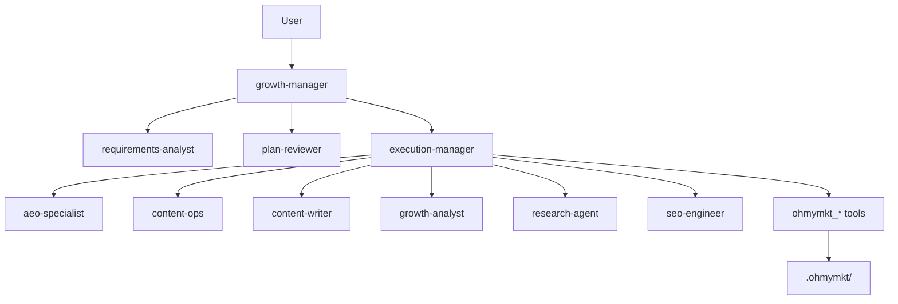

# ohmymkt

Marketing-first OpenCode plugin workspace.

`ohmymkt` keeps the upstream engine, but replaces agent topology, ultrawork routing, and runtime tools for marketing execution.

---

## What Is Different

- Primary agent is `growth-manager`
- Planning is handled by `requirements-analyst` + `plan-reviewer`
- Execution is routed by `execution-manager`
- Domain specialists focus on growth/SEO/content/research
- 18 native `ohmymkt_*` tools provide stateful marketing runtime
- Ultrawork has a dedicated `marketing` routing branch

---

## Architecture



---

## Quick Start

```bash
bun install
bun run typecheck
bun run build
```

Run focused verification:

```bash
bun test src/features/claude-code-agent-loader/loader.test.ts
bun test src/tools/ohmymkt/tools.test.ts
bun test src/tools/ohmymkt/contract.test.ts
bun test src/hooks/keyword-detector/ultrawork/source-detector.test.ts
```

Then open a session and trigger ultrawork:

```text
ulw create a 30-day content + SEO growth plan for our product
```

---

## Runtime Notes

- Marketing runtime state: `.ohmymkt/`
- Agent sources: `.claude/agents/`
- Project skills: `.opencode/skills/`
- Marketing tools: `src/tools/ohmymkt/`

---

## Docs

- `/docs/guide/overview.md`
- `/docs/guide/understanding-orchestration-system.md`
- `/docs/orchestration-guide.md`
- `/docs/configurations.md`
- `/docs/features.md`

---

## License

See `LICENSE.md`.
