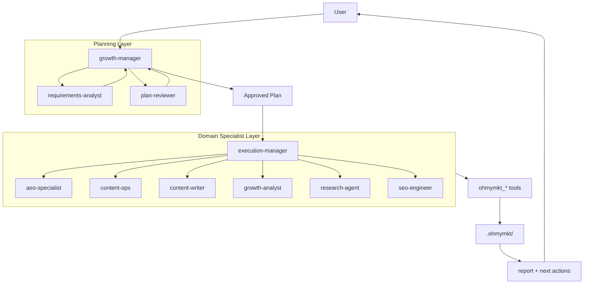
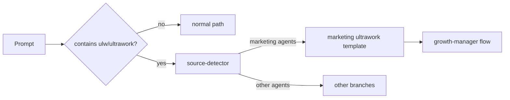
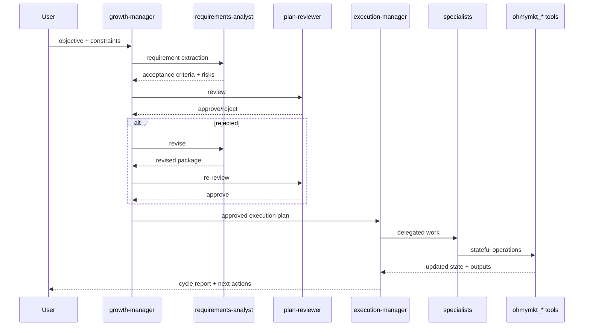
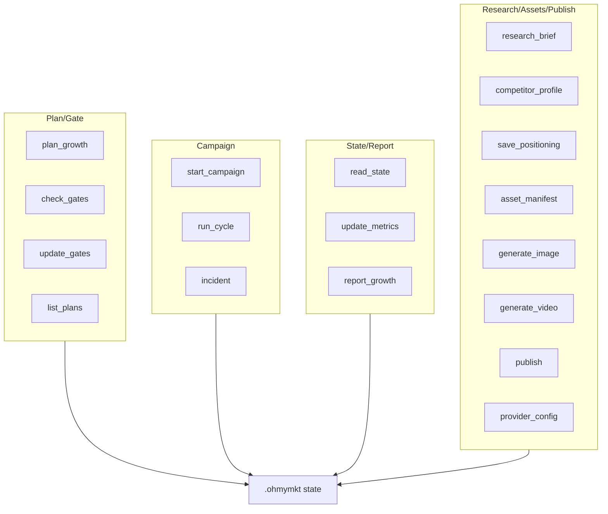

# ohmymkt

Marketing-first OpenCode plugin workspace.

`ohmymkt` keeps the upstream engine skeleton, but replaces agent topology, ultrawork routing, and runtime tools for growth/marketing execution.

---

## Important Naming Note

Current runtime identifiers are still upstream-compatible:

- npm package name: `oh-my-opencode`
- CLI binary: `oh-my-opencode`
- runtime config path in engine: `.opencode/oh-my-opencode.json`

Branding files are also provided:

- `.opencode/ohmymkt.json` (alias/mirror)
- `assets/ohmymkt.schema.json`

Use `oh-my-opencode.json` as runtime source of truth today.

---

## TL;DR

- Primary agent: `growth-manager`
- Planning gate: `requirements-analyst` + `plan-reviewer`
- Execution hub: `execution-manager`
- Domain specialists: `aeo-specialist`, `content-ops`, `content-writer`, `growth-analyst`, `research-agent`, `seo-engineer`
- Runtime tools: 18 `ohmymkt_*` tools
- Runtime state root: `.ohmymkt/`
- Fast mode keyword: `ultrawork` / `ulw`

---

## Architecture Overview



---

## Routing and Execution Semantics

### Ultrawork Source Routing



### Execution Sequence



---

## Agent Model

### Core Marketing Agents

| Agent | Role | Responsibility |
|---|---|---|
| `growth-manager` | primary | objective framing, prioritization, orchestration decisions |
| `requirements-analyst` | planning | requirement extraction, ambiguity removal, acceptance criteria |
| `plan-reviewer` | planning gate | reject weak plans, enforce verifiability |
| `execution-manager` | execution | specialist dispatch, dependency/cadence control, consolidation |

### Domain Specialists

| Agent | Focus |
|---|---|
| `aeo-specialist` | answer-engine retrieval structures |
| `content-ops` | publication operations and cadence |
| `content-writer` | content and asset draft generation |
| `growth-analyst` | metrics diagnosis and iteration strategy |
| `research-agent` | market and competitor intelligence |
| `seo-engineer` | technical SEO/indexability/schema |

---

## Tooling Model

All marketing runtime actions are in `src/tools/ohmymkt/`.

### 18 Tools

1. `ohmymkt_plan_growth`
2. `ohmymkt_check_gates`
3. `ohmymkt_start_campaign`
4. `ohmymkt_run_cycle`
5. `ohmymkt_incident`
6. `ohmymkt_report_growth`
7. `ohmymkt_list_plans`
8. `ohmymkt_update_gates`
9. `ohmymkt_update_metrics`
10. `ohmymkt_read_state`
11. `ohmymkt_research_brief`
12. `ohmymkt_save_positioning`
13. `ohmymkt_asset_manifest`
14. `ohmymkt_provider_config`
15. `ohmymkt_generate_image`
16. `ohmymkt_generate_video`
17. `ohmymkt_publish`
18. `ohmymkt_competitor_profile`

### Tool Family Graph



---

## Quick Start

```bash
bun install
bun run typecheck
bun run build
```

### Verify Core Contract

```bash
bun test src/features/claude-code-agent-loader/loader.test.ts
bun test src/tools/ohmymkt/tools.test.ts
bun test src/tools/ohmymkt/contract.test.ts
bun test src/hooks/keyword-detector/ultrawork/source-detector.test.ts
```

### First Smoke Prompt

```text
ulw build a 30-day content + SEO growth cycle for our B2B SaaS
```

Expected behavior:

- marketing ultrawork route selected
- planning gate loop runs before heavy execution
- runtime files are written under `.ohmymkt/`

---

## Installation Paths

### Human Path

- follow `/docs/guide/installation.md`
- validate config + tests
- run first ultrawork smoke

### LLM Agent Path

Use deterministic setup flow in `/docs/guide/installation.md`.

---

## Runtime Files and Directories

| Path | Purpose |
|---|---|
| `.claude/agents/` | project-level marketing agents |
| `.opencode/skills/` | project-level skills |
| `.opencode/oh-my-opencode.json` | runtime config source |
| `.opencode/ohmymkt.json` | branding alias config |
| `src/tools/ohmymkt/` | marketing runtime tools |
| `.ohmymkt/` | campaign runtime state |

---

## CLI and Config Quick Reference

### CLI

```bash
# install helper
bunx oh-my-opencode install

# run one session
bunx oh-my-opencode run --agent growth-manager "ulw run this week's growth cycle"

# diagnostics
bunx oh-my-opencode doctor --verbose

# MCP OAuth
bunx oh-my-opencode mcp oauth login <server-name> --server-url https://api.example.com
```

### Minimal Config Example

```json
{
  "default_run_agent": "growth-manager",
  "sisyphus_agent": { "disabled": true },
  "disabled_agents": [
    "sisyphus",
    "hephaestus",
    "oracle",
    "librarian",
    "explore",
    "multimodal-looker",
    "metis",
    "momus",
    "atlas"
  ]
}
```

---

## Documentation Map

### Core

- `/docs/guide/overview.md`
- `/docs/guide/understanding-orchestration-system.md`
- `/docs/orchestration-guide.md`

### Operational

- `/docs/features.md`
- `/docs/configurations.md`
- `/docs/cli-guide.md`
- `/docs/category-skill-guide.md`
- `/docs/task-system.md`

### Reliability

- `/docs/troubleshooting/ollama-streaming-issue.md`
- `/docs/ultrawork-manifesto.md`

---

## Compatibility Principle

`ohmymkt` does not replace the OpenCode core lifecycle.

It extends via native hooks/loaders/registries:

- agent loader
- skill loader
- tool registry
- keyword-detector ultrawork routing

This keeps behavior predictable and regression-testable.

---

## License

See `LICENSE.md`.
