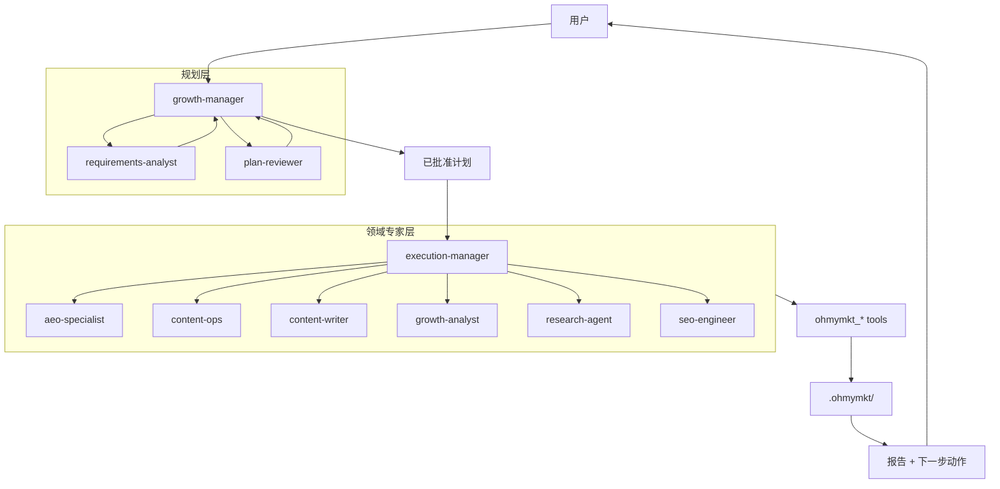
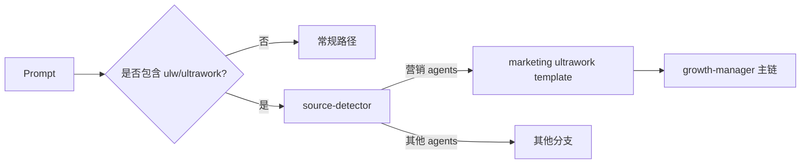
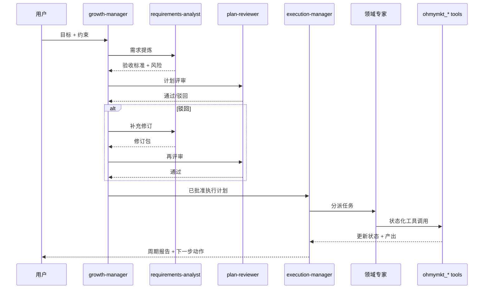
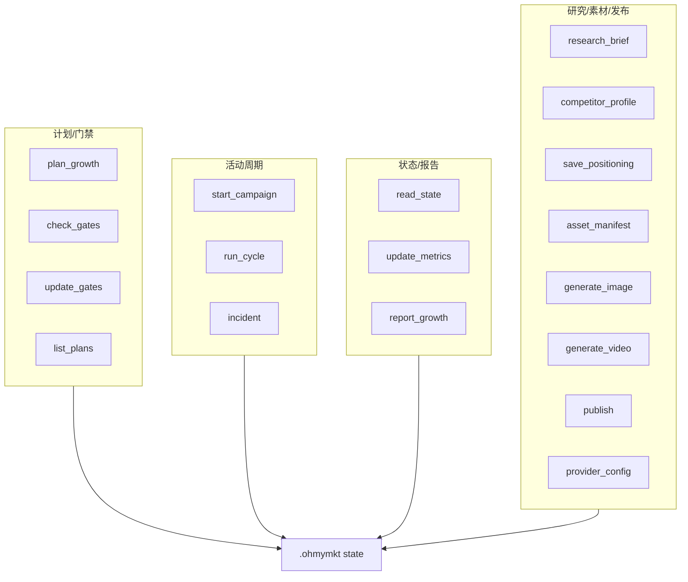

# ohmymkt

面向营销执行的 OpenCode 插件工作区。

`ohmymkt` 保留上游引擎骨架，但将 Agent 拓扑、ultrawork 路由与运行时工具改造成营销执行体系。

---

## 命名说明（非常重要）

当前运行时仍使用上游兼容标识：

- npm 包名：`oh-my-opencode`
- CLI 二进制：`oh-my-opencode`
- 引擎默认读取配置：`.opencode/oh-my-opencode.json`

本仓库同时提供品牌别名文件：

- `.opencode/ohmymkt.json`
- `assets/ohmymkt.schema.json`

当前建议：以 `.opencode/oh-my-opencode.json` 作为运行时真相源。

---

## TL;DR

- 主 Agent：`growth-manager`
- 规划门禁：`requirements-analyst` + `plan-reviewer`
- 执行中枢：`execution-manager`
- 领域专家：`aeo-specialist`、`content-ops`、`content-writer`、`growth-analyst`、`research-agent`、`seo-engineer`
- 运行时工具：18 个 `ohmymkt_*` 工具
- 状态目录：`.ohmymkt/`
- 快速触发词：`ultrawork` / `ulw`

---

## 架构总览



---

## 路由与执行语义

### Ultrawork 路由



### 执行时序



---

## Agent 模型

### 核心营销 Agent

| Agent | 层级角色 | 责任 |
|---|---|---|
| `growth-manager` | primary | 目标定义、优先级、编排决策 |
| `requirements-analyst` | planning | 消歧、补全需求、定义验收标准 |
| `plan-reviewer` | planning gate | 拒绝不可验证或职责不清的计划 |
| `execution-manager` | execution | 分派执行、控制依赖与节奏、汇总输出 |

### 领域专家

| Agent | 专长 |
|---|---|
| `aeo-specialist` | 面向答案引擎检索结构优化 |
| `content-ops` | 发布流程与节奏管理 |
| `content-writer` | 文案与素材草案生产 |
| `growth-analyst` | 指标诊断与迭代策略 |
| `research-agent` | 市场与竞品情报 |
| `seo-engineer` | 技术 SEO/可索引性/schema |

---

## 工具体系

所有营销运行时动作都在 `src/tools/ohmymkt/`。

### 18 个工具

1. `ohmymkt_plan_growth`
2. `ohmymkt_check_gates`
3. `ohmymkt_start_campaign`
4. `ohmymkt_run_cycle`
5. `ohmymkt_incident`
6. `ohmymkt_report_growth`
7. `ohmymkt_list_plans`
8. `ohmymkt_update_gates`
9. `ohmymkt_update_metrics`
10. `ohmymkt_read_state`
11. `ohmymkt_research_brief`
12. `ohmymkt_save_positioning`
13. `ohmymkt_asset_manifest`
14. `ohmymkt_provider_config`
15. `ohmymkt_generate_image`
16. `ohmymkt_generate_video`
17. `ohmymkt_publish`
18. `ohmymkt_competitor_profile`

### 工具家族图



---

## 快速开始

```bash
bun install
bun run typecheck
bun run build
```

### 核心契约验证

```bash
bun test src/features/claude-code-agent-loader/loader.test.ts
bun test src/tools/ohmymkt/tools.test.ts
bun test src/tools/ohmymkt/contract.test.ts
bun test src/hooks/keyword-detector/ultrawork/source-detector.test.ts
```

### 首次冒烟 Prompt

```text
ulw 为我们的 B2B SaaS 设计一个 30 天内容 + SEO 增长周期
```

预期：

- 进入 marketing ultrawork 路由
- 先经过规划门禁再进入重执行
- `.ohmymkt/` 产生状态文件

---

## 安装路径

### 人类操作路径

见：`/docs/guide/installation.md`

### LLM 代理操作路径

同样使用安装文档中的确定性步骤，不要跳过配置与测试验证。

---

## 运行时目录说明

| 路径 | 用途 |
|---|---|
| `.claude/agents/` | 项目级营销 Agent 定义 |
| `.opencode/skills/` | 项目级 skills |
| `.opencode/oh-my-opencode.json` | 运行时配置真相源 |
| `.opencode/ohmymkt.json` | 品牌别名配置 |
| `src/tools/ohmymkt/` | 营销运行时工具实现 |
| `.ohmymkt/` | 活动状态与产出存档 |

---

## CLI 与配置速查

### CLI

```bash
# 安装助手
bunx oh-my-opencode install

# 单次执行
bunx oh-my-opencode run --agent growth-manager "ulw run this week's growth cycle"

# 健康检查
bunx oh-my-opencode doctor --verbose

# MCP OAuth
bunx oh-my-opencode mcp oauth login <server-name> --server-url https://api.example.com
```

### 最小配置样例

```json
{
  "default_run_agent": "growth-manager",
  "sisyphus_agent": { "disabled": true },
  "disabled_agents": [
    "sisyphus",
    "hephaestus",
    "oracle",
    "librarian",
    "explore",
    "multimodal-looker",
    "metis",
    "momus",
    "atlas"
  ]
}
```

---

## 文档导航

### 核心

- `/docs/guide/overview.md`
- `/docs/guide/understanding-orchestration-system.md`
- `/docs/orchestration-guide.md`

### 运维/执行

- `/docs/features.md`
- `/docs/configurations.md`
- `/docs/cli-guide.md`
- `/docs/category-skill-guide.md`
- `/docs/task-system.md`

### 稳定性

- `/docs/troubleshooting/ollama-streaming-issue.md`
- `/docs/ultrawork-manifesto.md`

---

## 兼容性原则

`ohmymkt` 不重写 OpenCode 核心生命周期，而是通过原生扩展点增强：

- agent loader
- skill loader
- tool registry
- keyword-detector 的 ultrawork 路由

因此行为可测试、可回归、可演进。

---

## License

见 `LICENSE.md`。
