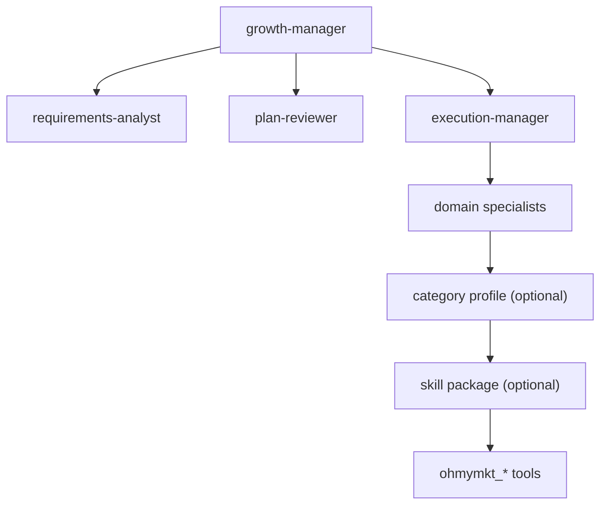
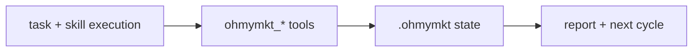

# Category & Skill System Guide (ohmymkt)

---

## 1. Overview

`ohmymkt` supports two complementary delegation layers:

1. **Agent topology layer** (marketing-first): growth/planning/execution/specialist agents
2. **Category + skill layer** (upstream-compatible): model/prompt/tool profiles and workflow packages

Use both together:

- topology decides *who owns what*
- categories/skills decide *how each task is executed*

---

## 2. Category System

Categories are reusable execution profiles for delegated tasks.

### Available Built-in Categories

| Category | Typical Use |
|---|---|
| `visual-engineering` | UI-heavy implementation tasks |
| `ultrabrain` | high reasoning + broad context |
| `deep` | deep implementation/refactoring tasks |
| `artistry` | copy/design-focused output |
| `quick` | low-latency short tasks |
| `unspecified-low` | cost-efficient fallback |
| `unspecified-high` | quality-first fallback |
| `writing` | long-form writing and structured output |

### Usage

```text
task(category="writing", prompt="Draft landing page copy for new pricing tier")
```

### Category Config Surface

Each category can define:

- model / variant
- temperature / top_p
- maxTokens / thinking / reasoningEffort / textVerbosity
- prompt_append
- tools allowlist/overrides
- disable flag
- unstable-agent hint

---

## 3. Marketing Delegation Topology

`ohmymkt` default route is marketing-agent-first.



### Equivalent to "Delegated Executor" Behavior

In the upstream model, category execution often routes through a delegated executor profile.
In `ohmymkt`, this execution concern is represented by `execution-manager` + specialists.

---

## 4. Skill System

Skills are packaged operating instructions with optional MCP/tool integration.

### Skill Sources

| Scope | Path |
|---|---|
| Project | `.opencode/skills/*/SKILL.md` |
| User | `~/.config/opencode/skills/*/SKILL.md` |
| Claude compat (project) | `.claude/skills/*/SKILL.md` |
| Claude compat (user) | `~/.claude/skills/*/SKILL.md` |

### Built-in System Skills

- `playwright`
- `agent-browser`
- `dev-browser`
- `frontend-ui-ux`
- `git-master`

### Marketing Skill Coverage Examples

| Marketing Need | Typical Skills |
|---|---|
| content strategy | `content-strategy`, `marketing-ideas` |
| copy and messaging | `copywriting`, `copy-editing`, `email-sequence`, `social-content` |
| conversion optimization | `page-cro`, `signup-flow-cro`, `onboarding-cro`, `paywall-upgrade-cro` |
| discovery and SEO | `seo-audit`, `schema-markup`, `programmatic-seo`, `competitor-alternatives` |
| launch + growth ops | `launch-strategy`, `paid-ads`, `referral-program`, `analytics-tracking` |

---

## 5. Skill Customization (SKILL.md)

A skill can define:

- trigger description
- operating workflow
- references/templates
- MCP dependencies
- tool usage guidance

Minimal example:

```markdown
# My Skill

When to use:
- Use for weekly growth report synthesis

Workflow:
1. Read `.ohmymkt` state
2. Summarize metric deltas
3. Propose next actions
```

---

## 6. Combination Strategies (Combos)

### Combo A: Launch Builder

- Topology: `growth-manager -> requirements-analyst -> plan-reviewer -> execution-manager`
- Category: `ultrabrain` for planning, `writing` for assets
- Skills: `launch-strategy`, `copywriting`, `social-content`
- Tools: `ohmymkt_plan_growth`, `ohmymkt_start_campaign`, `ohmymkt_publish`

### Combo B: SEO + AEO Sprint

- Specialists: `seo-engineer` + `aeo-specialist`
- Skills: `seo-audit`, `schema-markup`
- Tools: `ohmymkt_check_gates`, `ohmymkt_update_gates`, `ohmymkt_run_cycle`

### Combo C: Weekly Optimization Loop

- Specialist: `growth-analyst`
- Skills: `analytics-tracking`, `ab-test-setup`
- Tools: `ohmymkt_update_metrics`, `ohmymkt_report_growth`

---

## 7. `task` Prompt Guide

When delegating tasks, include:

1. objective + measurable success criteria
2. constraints (budget/time/channel)
3. expected output format
4. required skills/categories (if any)
5. tool/state requirements

Example:

```text
category=writing
load_skills=["copywriting", "email-sequence"]
prompt="Write a 5-email activation sequence. Goal: increase activation rate from 28% to 35%. Use current pricing/positioning context, then output subject + body + CTA + hypothesis per email."
```

---

## 8. Configuration Guide (`oh-my-opencode.json`)

Category/skill behavior is configured in plugin config.

### Category Configuration Schema (Concept)

- per-category model and generation controls
- optional prompt/tool policy
- disable toggle

### Skills Configuration Schema (Concept)

- sources
- enable list
- disable list
- inline custom skill definitions

---

## 9. Tool Alignment Rule

If a skill or category task needs campaign state mutation, always route through `ohmymkt_*` tools.

Do not keep critical campaign truth only in chat history.



---

## 10. Practical Defaults for ohmymkt

- strategy/planning first: use `growth-manager` path
- apply categories for execution tuning, not ownership
- prefer explicit skill loading for high-cost tasks
- verify contract test when adding new `ohmymkt_*` references
