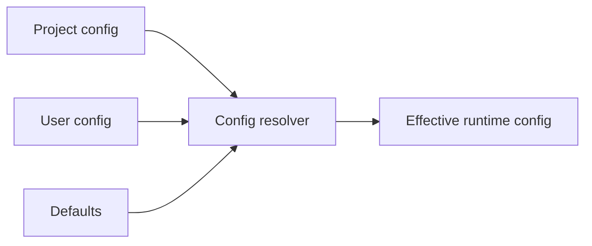
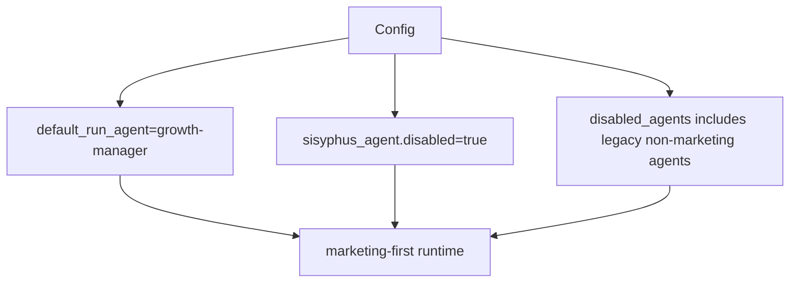
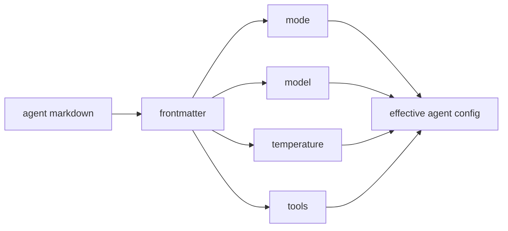
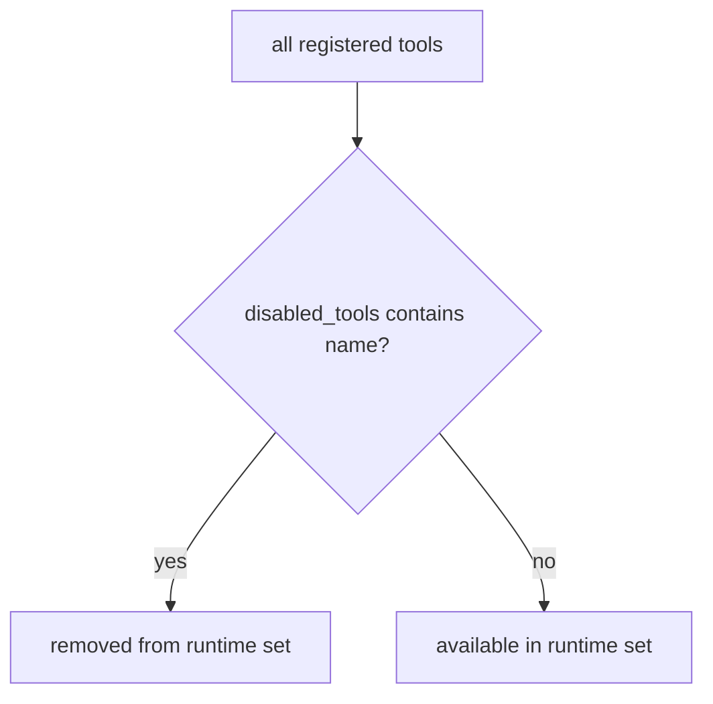
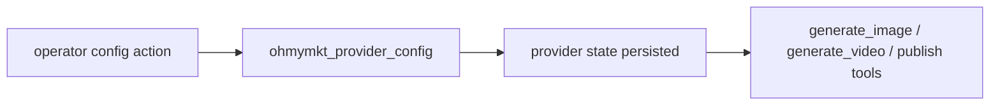
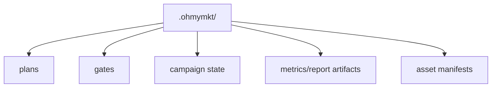

# ohmymkt Configurations

This guide covers configuration relevant to the marketing topology.

---

## Config Scope

Configuration resolution follows standard OpenCode order:

1. project-level config in `.opencode/`
2. user-level config in `~/.config/opencode/`
3. built-in defaults

For branding consistency, use `ohmymkt` naming in project docs and team conventions.



---

## Recommended Project Config (Marketing)

Use a project config that:

- sets `growth-manager` as default run agent
- disables non-marketing agents in this workspace
- preserves required hooks/tool infrastructure

Example:

```json
{
  "default_run_agent": "growth-manager",
  "sisyphus_agent": { "disabled": true },
  "disabled_agents": [
    "oracle",
    "librarian",
    "explore",
    "plan"
  ]
}
```



---

## Agent Frontmatter Extensions

Project agents in `.claude/agents/*.md` support:

- `mode?: "primary" | "subagent"`
- `model?: string`
- `temperature?: number`
- `tools?: string[]`

Use these to keep execution behavior explicit at agent definition level.



---

## Tool Gating

Marketing tools are registered through the main tool registry.

You can still control availability with `disabled_tools` using exact tool names (for example `ohmymkt_publish`).



---

## Provider Settings

External providers used by image/video/publish tools are configured via:

- `ohmymkt_provider_config`

This keeps secrets and provider routing out of agent prompt text.



---

## Runtime Directories

- marketing runtime state: `.ohmymkt/`
- planning/task artifacts: engine-managed state directories



---

## Validation

After config changes:

```bash
bun run typecheck
bun run build
bun test src/features/claude-code-agent-loader/loader.test.ts
bun test src/tools/ohmymkt/tools.test.ts
bun test src/tools/ohmymkt/contract.test.ts
```
