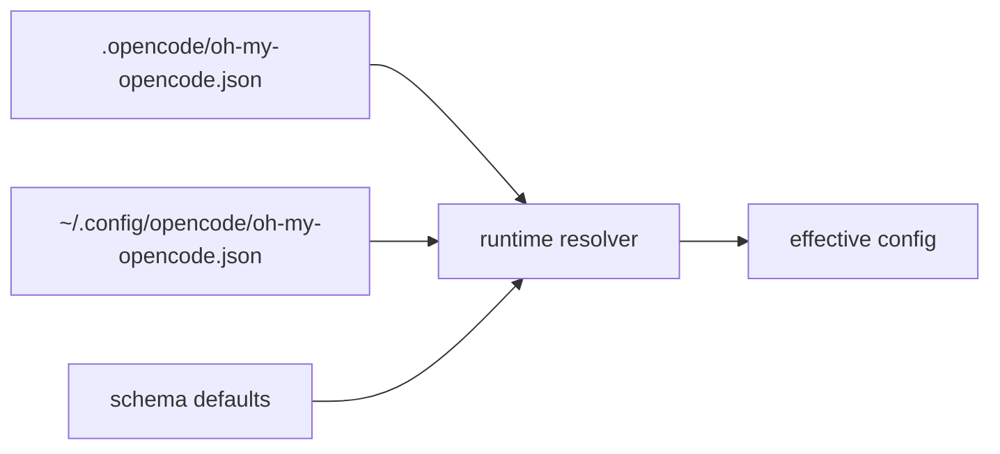
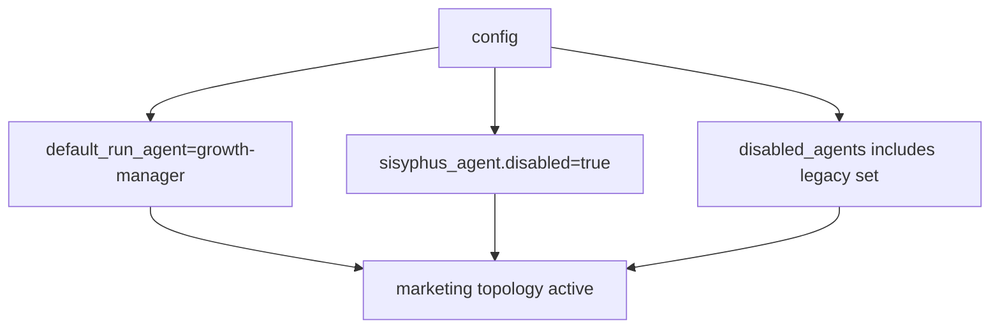
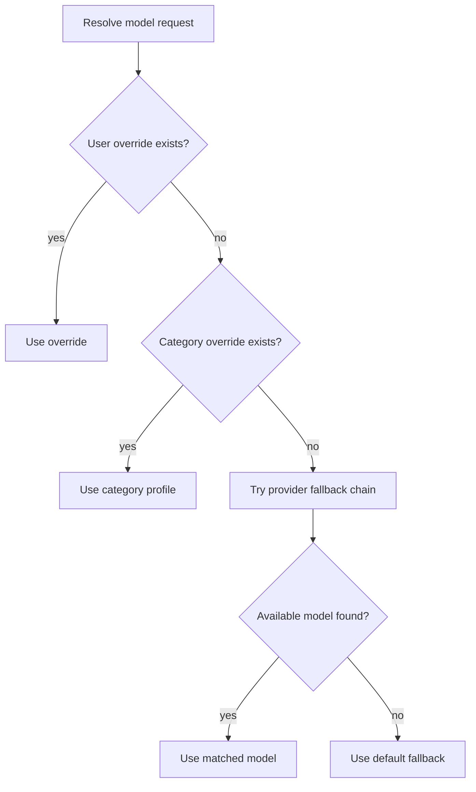
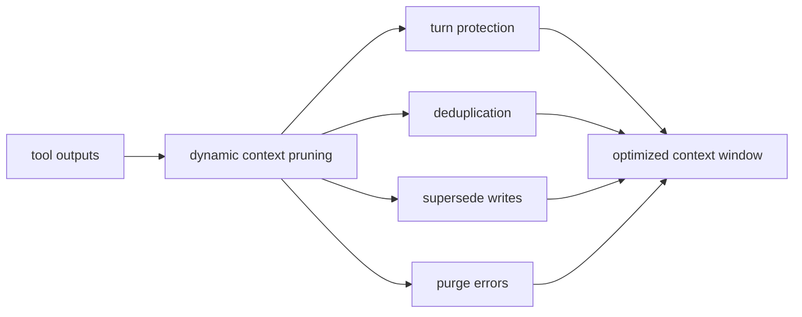

# ohmymkt Configuration

---

## Quick Start

Use this as a practical baseline for the marketing topology:

```jsonc
{
  "$schema": "https://raw.githubusercontent.com/bravohenry/ohmymkt/master/assets/ohmymkt.schema.json",
  "default_run_agent": "growth-manager",
  "sisyphus_agent": {
    "disabled": true
  },
  "disabled_agents": [
    "sisyphus",
    "hephaestus",
    "oracle",
    "librarian",
    "explore",
    "multimodal-looker",
    "metis",
    "momus",
    "atlas"
  ],
  "claude_code": {
    "agents": true,
    "skills": true
  },
  "disabled_tools": []
}
```

---

## Config File Locations

### Runtime-Effective Config Path

Current runtime code resolves plugin config as:

1. project: `.opencode/oh-my-opencode.json`
2. user: `~/.config/opencode/oh-my-opencode.json`

### Branding Alias

For branding consistency, this repo also ships `.opencode/ohmymkt.json` and `assets/ohmymkt.schema.json`.

Recommendation:

- keep `.opencode/oh-my-opencode.json` as runtime source of truth
- optionally keep `.opencode/ohmymkt.json` mirrored for docs/team conventions



---

## JSONC Support

Configuration supports JSONC:

- comments allowed
- trailing commas allowed

`.jsonc` variants have priority over `.json` when both exist.

---

## Google Auth

Google auth is controlled through provider setup and installation flow.

If you use antigravity/google provider paths, verify login status with `doctor` and runtime provider listing.

---

## Ollama Provider

### Required Configuration

For tool-heavy flows, prefer non-streaming mode for stability when your stack exhibits JSON parse issues.

### Why `stream: false` Is Commonly Recommended

Certain provider/tool combinations can emit malformed incremental chunks during tool calling, causing parser failures.

### Supported Models

Model availability depends on your local Ollama registry and OpenCode provider integration.

### Troubleshooting

See:

- `docs/troubleshooting/ollama-streaming-issue.md`

---

## Agents

### Agent Override Structure

Agent overrides are configured under `agents` and support:

| Field | Type | Purpose |
|---|---|---|
| `model` | string | direct model override (deprecated preference: use `category`) |
| `category` | string | inherit category model/profile |
| `variant` | string | model/provider variant |
| `skills` | string[] | inject skills |
| `temperature` / `top_p` | number | sampling controls |
| `prompt` / `prompt_append` | string | prompt customization |
| `tools` | map<string, boolean> | per-tool allow/deny |
| `permission` | object | permission policy |
| `maxTokens` | number | response cap |
| `thinking` | object | Anthropic-style thinking controls |
| `reasoningEffort` | enum | OpenAI reasoning effort |
| `textVerbosity` | enum | output verbosity |
| `providerOptions` | object | provider-specific passthrough |
| `disable` | boolean | disable agent |
| `mode` | enum | `subagent` / `primary` / `all` |
| `color` | hex | UI color |

### Marketing Topology Defaults

Project-level `.claude/agents/*.md` controls marketing primary/subagent topology.

Key defaults:

- `growth-manager` as primary
- planning via `requirements-analyst` + `plan-reviewer`
- execution via `execution-manager`

### Additional Agent Options

Runtime still supports upstream agent override fields and fallback chains for built-in agents.

This is useful when you selectively enable upstream agents for experiments.

### Thinking Options (Anthropic)

```jsonc
{
  "agents": {
    "prometheus": {
      "thinking": {
        "type": "enabled",
        "budgetTokens": 16000
      }
    }
  }
}
```

### Permission Options

Use `permission` inside an agent override for strict tool/file controls.

---

## Built-in Skills

Upstream built-ins are still available (unless disabled):

- `playwright`
- `agent-browser`
- `dev-browser`
- `frontend-ui-ux`
- `git-master`

---

## Skills Configuration

`skills` supports either:

- simple list
- object form with sources/enable/disable/inline definitions

### Sources

| Example | Meaning |
|---|---|
| `".opencode/skills"` | load all skills from folder |
| `{ "path": ".opencode/skills", "recursive": true }` | recursive source |
| `{ "path": ".opencode/skills", "glob": "**/SKILL.md" }` | explicit glob |

### Enable/Disable Skills

```jsonc
{
  "skills": {
    "enable": ["copywriting", "seo-audit"],
    "disable": ["some-skill"]
  }
}
```

### Custom Skill Definition

`skills` object supports inline custom entries with metadata, model, tool allowlists, and disable flags.

---

## Browser Automation

`browser_automation_engine.provider` supports:

- `playwright` (default)
- `agent-browser`
- `dev-browser`

```json
{
  "browser_automation_engine": {
    "provider": "playwright"
  }
}
```

### Playwright (Default)

Best default for deterministic browser tasks and MCP-integrated automation.

### agent-browser

Alternative provider for Vercel agent-browser workflows.

---

## Tmux Integration

`tmux` config controls background subagent pane orchestration.

| Key | Default | Description |
|---|---|---|
| `enabled` | `false` | enable tmux-aware subagent panes |
| `layout` | `main-vertical` | pane arrangement |
| `main_pane_size` | `60` | main pane ratio |
| `main_pane_min_width` | `120` | main pane minimum width |
| `agent_pane_min_width` | `40` | agent pane minimum width |

### Layout Options

- `main-horizontal`
- `main-vertical`
- `tiled`
- `even-horizontal`
- `even-vertical`

### Requirements

- run within tmux session
- use server mode where required for your workflow

### How It Works

Background tasks are mapped to tmux panes for live parallel visibility.

---

## Git Master

`git_master` options:

| Option | Default | Description |
|---|---|---|
| `commit_footer` | `true` | append branded footer or custom string |
| `include_co_authored_by` | `true` | append co-authored trailer |

---

## Marketing Orchestration Profile

The `sisyphus_agent` block is retained for upstream compatibility but is typically disabled in this workspace:

```json
{
  "sisyphus_agent": {
    "disabled": true
  }
}
```

`default_run_agent` should point to `growth-manager` for marketing-first execution.



---

## Background Tasks

`background_task` controls concurrency and stale task handling.

| Key | Description |
|---|---|
| `defaultConcurrency` | global default concurrency |
| `providerConcurrency` | provider-specific caps |
| `modelConcurrency` | model-specific caps |
| `staleTimeoutMs` | inactivity timeout (min 60000) |

Recommended for heavy campaigns:

```json
{
  "background_task": {
    "defaultConcurrency": 4,
    "staleTimeoutMs": 180000
  }
}
```

---

## Categories

Categories remain available for `task` delegation and model profiles.

### Built-in Categories

- `visual-engineering`
- `ultrabrain`
- `deep`
- `artistry`
- `quick`
- `unspecified-low`
- `unspecified-high`
- `writing`

### Critical: Model Resolution Priority

1. explicit user override
2. category override
3. provider fallback chain
4. default model

### Recommended Pattern in ohmymkt

Use categories for low-level worker tuning, while strategy stays at marketing agent topology.

### Custom Categories

`categories` is a record map; each category supports model, prompt_append, tools, disable, and more.

---

## Model Resolution System

### Overview

Model resolution is dynamic and request-scoped.

### Resolution Flow



### Agent Provider Chains

Each built-in agent has provider chains in model-requirements logic.

### Category Provider Chains

Category-based requests can resolve with separate fallback paths.

### Checking Your Configuration

Run:

```bash
bunx oh-my-opencode doctor --verbose
```

### Manual Override

Use explicit `agents.<name>.model` or category model entries.

---

## Hooks

Disable specific hooks with `disabled_hooks`.

```json
{
  "disabled_hooks": [
    "comment-checker",
    "auto-update-checker"
  ]
}
```

---

## Disabled Commands

Disable specific built-ins via `disabled_commands`.

```json
{
  "disabled_commands": ["ralph-loop", "ulw-loop"]
}
```

---

## Comment Checker

Customize prompt via `comment_checker.custom_prompt`.

---

## Notification

Force session notification behavior via `notification.force_enable`.

---

## Task System Compatibility

`new_task_system_enabled` and `experimental.task_system` control task system behavior.

Keep disabled unless you are actively testing task-system variants.

---

## MCPs

Disable built-ins via `disabled_mcps` when required.

---

## LSP

`ohmymkt` keeps upstream LSP support and toolchain:

- diagnostics
- symbol/reference navigation
- rename tooling

LSP server settings in OpenCode config continue to work.

---

## Experimental

Supported flags include:

- `aggressive_truncation`
- `auto_resume`
- `preemptive_compaction`
- `truncate_all_tool_outputs`
- `plugin_load_timeout_ms`
- `safe_hook_creation`
- `dynamic_context_pruning`

### Dynamic Context Pruning

Controls:

- `enabled`
- `notification`
- `turn_protection`
- `protected_tools`
- `strategies` (`deduplication`, `supersede_writes`, `purge_errors`)



---

## Environment Variables

Common variables:

| Variable | Purpose |
|---|---|
| `OPENCODE_DEFAULT_AGENT` | overrides default run agent |
| `OPENCODE_CONFIG_DIR` | custom config root |

Provider-specific API keys depend on your configured providers (OpenAI, Google, Z.ai, etc.).

---

## Validation

After configuration changes:

```bash
bun run typecheck
bun run build
bun test src/features/claude-code-agent-loader/loader.test.ts
bun test src/tools/ohmymkt/tools.test.ts
bun test src/tools/ohmymkt/contract.test.ts
bun test src/hooks/keyword-detector/ultrawork/source-detector.test.ts
```
