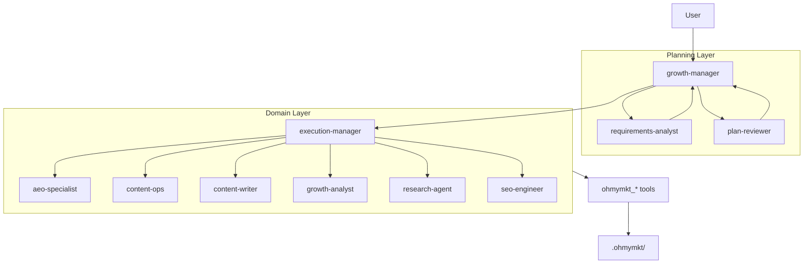
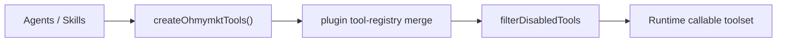
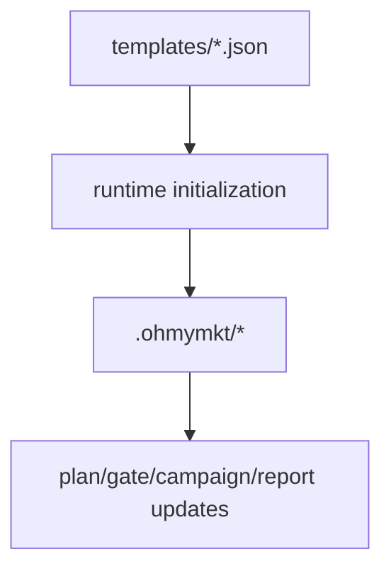
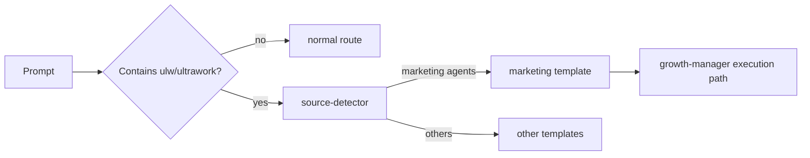

# ohmymkt Features

---

## Agents: Your Marketing AI Team

`ohmymkt` runs a layered marketing topology on top of the upstream OpenCode engine.

### Core Marketing Agents

| Agent | Role | Primary Responsibility |
|---|---|---|
| `growth-manager` | Primary | Owns objective framing, sequencing, and final execution decisions |
| `execution-manager` | Execution hub | Dispatches domain specialists and controls cycle cadence |
| `requirements-analyst` | Planning | Converts intent to explicit requirements + acceptance criteria |
| `plan-reviewer` | Planning gate | Rejects unclear plans and enforces verifiability |

### Domain Specialists

| Agent | Domain |
|---|---|
| `aeo-specialist` | Answer-engine optimization and retrieval-facing structures |
| `content-ops` | Editorial operations and publishing cadence |
| `content-writer` | Copy + asset generation briefs |
| `growth-analyst` | Metrics diagnosis and iteration strategy |
| `research-agent` | Market/competitor intelligence |
| `seo-engineer` | Technical SEO, structure, schema |

### Architecture Map



### Invoking Agents Explicitly

The primary flow auto-routes delegation, but explicit requests work well for constrained tasks:

```text
Ask @requirements-analyst to list missing requirements before launch
Ask @plan-reviewer to reject any non-measurable deliverables
Ask @execution-manager to sequence specialists for a 2-week cycle
Ask @growth-analyst to diagnose why week-2 CTR dropped
```

### Tool Boundary Principle

- planning agents must not bypass acceptance criteria
- domain specialists should not redefine orchestration policy
- critical state changes should be persisted via `ohmymkt_*` tools

---

## Marketing Runtime Tools

18 native tools are registered under `src/tools/ohmymkt/`.

### Tool Registry Integration



### Tool Families

| Family | Tools |
|---|---|
| Plan & Gate | `ohmymkt_plan_growth`, `ohmymkt_check_gates`, `ohmymkt_update_gates`, `ohmymkt_list_plans` |
| Campaign & Incident | `ohmymkt_start_campaign`, `ohmymkt_run_cycle`, `ohmymkt_incident` |
| State & Reporting | `ohmymkt_read_state`, `ohmymkt_update_metrics`, `ohmymkt_report_growth` |
| Research & Positioning | `ohmymkt_research_brief`, `ohmymkt_competitor_profile`, `ohmymkt_save_positioning` |
| Assets & Publish | `ohmymkt_asset_manifest`, `ohmymkt_generate_image`, `ohmymkt_generate_video`, `ohmymkt_publish`, `ohmymkt_provider_config` |

### Runtime State Path

- state root: `.ohmymkt/`
- templates: `src/tools/ohmymkt/templates/`



---

## Skills: Specialized Workflows

Skills provide reusable, domain-specific operating procedures.

### Project Skill Sources

| Scope | Path |
|---|---|
| Project | `.opencode/skills/*/SKILL.md` |
| User | `~/.config/opencode/skills/*/SKILL.md` |
| Claude compatibility (project) | `.claude/skills/*/SKILL.md` |
| Claude compatibility (user) | `~/.claude/skills/*/SKILL.md` |

### Marketing Skill Clusters

| Cluster | Typical Skills |
|---|---|
| Strategy | `content-strategy`, `marketing-ideas`, `pricing-strategy`, `launch-strategy` |
| Research | `competitor-alternatives`, `marketing-psychology`, `seo-audit` |
| Content Production | `copywriting`, `copy-editing`, `social-content`, `email-sequence` |
| Conversion | `page-cro`, `signup-flow-cro`, `onboarding-cro`, `paywall-upgrade-cro`, `popup-cro`, `form-cro` |
| Distribution | `paid-ads`, `schema-markup`, `programmatic-seo`, `referral-program` |

### Built-in System Skills (Upstream Compatibility)

`ohmymkt` keeps upstream built-in skill mechanics:

- `playwright` / browser automation
- `frontend-ui-ux`
- `git-master`

Disable built-ins via `disabled_skills` in config.

---

## Commands: Slash Workflows

`ohmymkt` keeps the upstream slash-command infrastructure and project command templates.

### Common Built-in Commands

| Command | Purpose |
|---|---|
| `/init-deep` | initialize hierarchical AGENTS context |
| `/ralph-loop` | iterative autonomous loop |
| `/ulw-loop` | ultrawork loop variant |
| `/cancel-ralph` | cancel active loop |
| `/refactor` | structured refactoring workflow |
| `/start-work` | start planned execution workflow |

### Project Command Templates

Additional project command docs live in `.opencode/command/`.

Examples:

- `publish.md`
- `get-unpublished-changes.md`
- `omomomo.md`

---

## Hooks: Lifecycle Automation

Hooks remain native OpenCode/OMO-compatible. `ohmymkt` extends behavior mainly via routing and tool wiring.

### Hook Events

| Event | When |
|---|---|
| `PreToolUse` | before a tool call |
| `PostToolUse` | after a tool call |
| `UserPromptSubmit` | when user submits prompt |
| `Stop` | when session idles/stops |

### Critical Hook Families

| Family | Typical Hooks | Why It Matters |
|---|---|---|
| Context injection | directory AGENTS/README injectors, rules injector | keeps local context consistent |
| Routing & modes | keyword-detector, think-mode, start-work | controls ultrawork/plan routing |
| Safety & recovery | session-recovery, edit-error-recovery, validators | reduces broken-tool interruptions |
| Output control | grep/tool output truncators | protects context window budget |
| UX & notifications | background/session notifications | visibility for async tasks |

### Marketing Ultrawork Extension

`keyword-detector` ultrawork path includes a dedicated `marketing` source branch.



---

## Tools: Agent Capabilities

### LSP Tools

| Tool | Description |
|---|---|
| `lsp_diagnostics` | diagnostics before build/test |
| `lsp_prepare_rename` | validate rename safety |
| `lsp_rename` | workspace rename |
| `lsp_goto_definition` | navigate definitions |
| `lsp_find_references` | usage search |
| `lsp_symbols` | file/workspace symbol lookup |

### AST-Grep Tools

| Tool | Description |
|---|---|
| `ast_grep_search` | AST-aware code search |
| `ast_grep_replace` | AST-aware replacement |

### Delegation & Session Tools

| Tool | Description |
|---|---|
| `task` | category/agent delegation |
| `call_omo_agent` | direct agent delegation with background support |
| `background_output` | fetch async task result |
| `background_cancel` | cancel async task |
| `session_list` / `session_read` / `session_search` / `session_info` | session history and lookup |

### Interactive Terminal Tool

| Tool | Description |
|---|---|
| `interactive_bash` | tmux-based interactive terminal operations |

---

## MCPs: Built-in and Skill-Embedded

### Built-in MCPs (Upstream Compatible)

- `websearch` (Exa)
- `context7`
- `grep_app`

### Skill-Embedded MCPs

Skills can ship MCP definitions and schemas, including OAuth-enabled remote servers.

### OAuth Capabilities

- OAuth metadata discovery
- PKCE flow
- token refresh and persistence
- CLI pre-auth support via `mcp oauth` commands

---

## Context Injection

### Directory AGENTS.md

Context loader can walk upward from target file to project root and inject layered AGENTS context.

### Conditional Rules

Rules in `.claude/rules/` can be injected by pattern or always-apply mode.

---

## Claude Code Compatibility

`ohmymkt` keeps compatibility loading paths and toggles.

### Compatibility Loaders

| Type | Locations |
|---|---|
| Commands | `~/.claude/commands/`, `.claude/commands/` |
| Skills | `~/.claude/skills/*/SKILL.md`, `.claude/skills/*/SKILL.md` |
| Agents | `~/.claude/agents/*.md`, `.claude/agents/*.md` |
| MCPs | `~/.claude/.mcp.json`, `.mcp.json`, `.claude/.mcp.json` |

### Feature Toggles

Use `claude_code` config toggles to disable compatibility sub-features selectively.

---

## Contract and Regression Guard

The following tests guard core behavior:

```bash
bun test src/features/claude-code-agent-loader/loader.test.ts
bun test src/tools/ohmymkt/tools.test.ts
bun test src/tools/ohmymkt/contract.test.ts
bun test src/hooks/keyword-detector/ultrawork/source-detector.test.ts
```

These ensure tool registration, token compatibility, agent loading rules, and marketing ultrawork routing remain stable.
