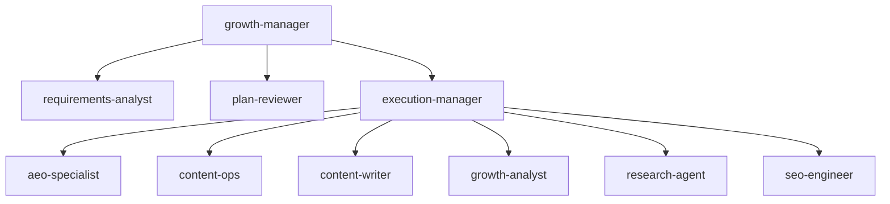
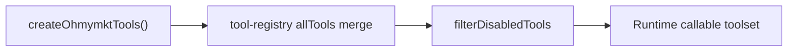
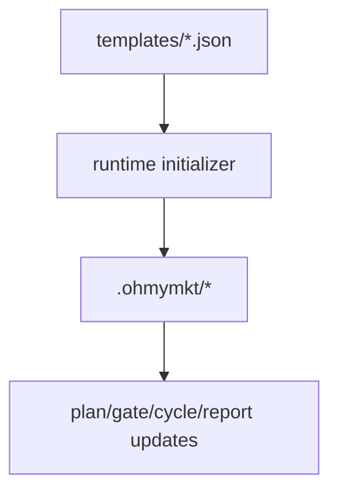
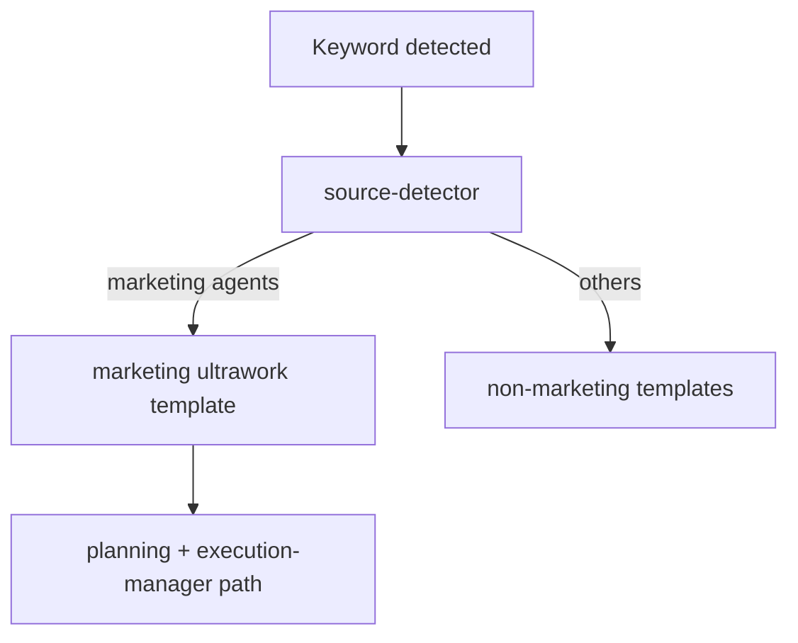
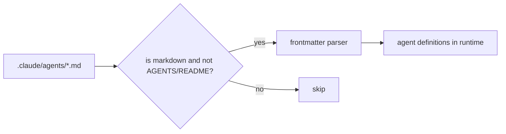
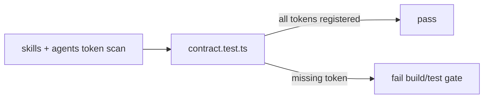

# ohmymkt Features

This page summarizes the marketing-focused feature set.

---

## 1. Agent Topology

`ohmymkt` uses a layered marketing topology:

- Primary: `growth-manager`
- Planning: `requirements-analyst`, `plan-reviewer`
- Execution: `execution-manager`
- Domain specialists:
  - `aeo-specialist`
  - `content-ops`
  - `content-writer`
  - `growth-analyst`
  - `research-agent`
- `seo-engineer`

This replaces generic coding orchestration with marketing orchestration while keeping upstream OpenCode engine hooks/tooling.

---

## 2. Marketing Runtime Tools

18 native runtime tools are registered via `src/tools/ohmymkt/index.ts`:

1. `ohmymkt_plan_growth`
2. `ohmymkt_check_gates`
3. `ohmymkt_start_campaign`
4. `ohmymkt_run_cycle`
5. `ohmymkt_incident`
6. `ohmymkt_report_growth`
7. `ohmymkt_list_plans`
8. `ohmymkt_update_gates`
9. `ohmymkt_update_metrics`
10. `ohmymkt_read_state`
11. `ohmymkt_research_brief`
12. `ohmymkt_save_positioning`
13. `ohmymkt_asset_manifest`
14. `ohmymkt_provider_config`
15. `ohmymkt_generate_image`
16. `ohmymkt_generate_video`
17. `ohmymkt_publish`
18. `ohmymkt_competitor_profile`

---

## 3. State and Templates

Runtime state is stored in `.ohmymkt/`.

Template files live under `src/tools/ohmymkt/templates/`:

- `gates.template.json`
- `metrics.template.json`
- `modules.template.json`
- `task-pool-40.json`

---

## 4. Ultrawork (Marketing Route)

Keyword trigger: `ultrawork` / `ulw`

When a marketing primary/planning agent is active, ultrawork uses the marketing injection template and marketing delegation path.

It intentionally avoids legacy non-marketing delegation instructions.

---

## 5. Agent Loader Behavior

Project agents are loaded from `.claude/agents/*.md`.

Loader rules:

- accepts markdown agent files
- ignores `AGENTS.md` and `README.md`
- parses frontmatter extensions:
  - `mode: primary|subagent`
  - `model`
  - `temperature`
  - `tools`

---

## 6. Skill Integration

Project skills in `.opencode/skills/` can call `ohmymkt_*` tools directly.

Contract test ensures all `ohmymkt_*` tokens referenced by agents/skills exist in the registered toolset.

---

## 7. Compatibility Principle

The fork keeps upstream OpenCode skeleton features (hooks, slash commands, task/background mechanisms).

Customizations are done through native extension points, not runtime bypasses.
