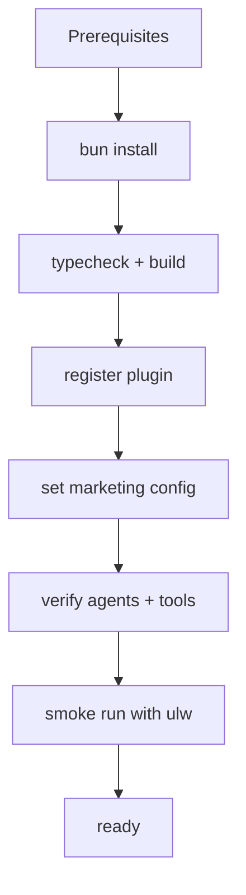

# Installation

This guide installs `ohmymkt` in a way that preserves marketing topology defaults and OMO-compatible runtime behavior.

---

## For Humans

### 1) Prerequisites

- Bun installed
- OpenCode available
- Repository cloned locally

### 2) Install Dependencies

```bash
bun install
```

### 3) Build Validation

```bash
bun run typecheck
bun run build
```

### 4) Configure Plugin Registration

Ensure OpenCode plugin registration points to this build or package form used in your environment.

### 5) Set Marketing Runtime Defaults

Create/verify `.opencode/oh-my-opencode.json`:

```json
{
  "default_run_agent": "growth-manager",
  "sisyphus_agent": { "disabled": true },
  "disabled_agents": [
    "sisyphus",
    "hephaestus",
    "oracle",
    "librarian",
    "explore",
    "multimodal-looker",
    "metis",
    "momus",
    "atlas"
  ],
  "claude_code": {
    "agents": true,
    "skills": true
  }
}
```

### 6) Verify Agent Topology

Check `.claude/agents/` includes:

- `growth-manager` (primary)
- `requirements-analyst`
- `plan-reviewer`
- `execution-manager`
- `aeo-specialist`
- `content-ops`
- `content-writer`
- `growth-analyst`
- `research-agent`
- `seo-engineer`

### 7) Verify Tool Wiring

```bash
bun test src/features/claude-code-agent-loader/loader.test.ts
bun test src/tools/ohmymkt/tools.test.ts
bun test src/tools/ohmymkt/contract.test.ts
bun test src/hooks/keyword-detector/ultrawork/source-detector.test.ts
```

### 8) Smoke Run

```text
ulw create a 2-week onboarding activation campaign with SEO support
```

Expected:

- marketing route selected
- no legacy non-marketing ultrawork injection
- `.ohmymkt/` state files created or updated

---

## For LLM Agents

Use this scripted flow when setting up for a user.

### Step 0: Ask User Inputs

Collect:

1. target project directory
2. provider subscriptions (Claude/OpenAI/Gemini/Copilot/Z.ai/Kimi)
3. whether they want strict marketing-only topology

### Step 1: Install and Build

```bash
bun install
bun run typecheck
bun run build
```

### Step 2: Run Installer (Optional Upstream Helper)

```bash
bunx oh-my-opencode install
```

For non-interactive flows:

```bash
bunx oh-my-opencode install --no-tui --claude=yes --openai=no --gemini=no --copilot=no
```

### Step 3: Enforce Marketing Defaults

Patch `.opencode/oh-my-opencode.json` with:

- `default_run_agent=growth-manager`
- `sisyphus_agent.disabled=true`
- disable legacy built-ins in `disabled_agents`

### Step 4: Verify Contract Tests

Run the four focused tests listed above.

### Step 5: Demonstrate First Prompt

```text
ulw draft plan + review + execution for a 30-day demand-gen cycle
```

---

## Provider Setup Notes

### Anthropic / OpenAI / Gemini

Use your OpenCode provider authentication flow, then validate with:

```bash
bunx oh-my-opencode doctor --category authentication --verbose
```

### MCP OAuth Providers

If skills require OAuth MCP servers:

```bash
bunx oh-my-opencode mcp oauth login <server-name> --server-url https://api.example.com
```

### Media/Publish Providers (Marketing Tools)

Configure through runtime tool calls:

- `ohmymkt_provider_config`

---

## Validation Checklist

- build passes
- marketing agents load correctly
- `AGENTS.md` is not loaded as executable agent
- 18 `ohmymkt_*` tools are registered
- marketing ultrawork source routing is active

---

## Installation Flow Diagram



---

## Common Pitfalls

1. Only creating `.opencode/ohmymkt.json` but not `.opencode/oh-my-opencode.json`
2. Forgetting to disable legacy built-in agents while expecting pure marketing behavior
3. Missing provider configuration for image/video/publish tasks
4. Running ultrawork prompts without marketing primary agent in config

---

## Post-Install Next Steps

- read `docs/guide/overview.md`
- read `docs/guide/understanding-orchestration-system.md`
- follow `docs/orchestration-guide.md` for operator runbook usage
