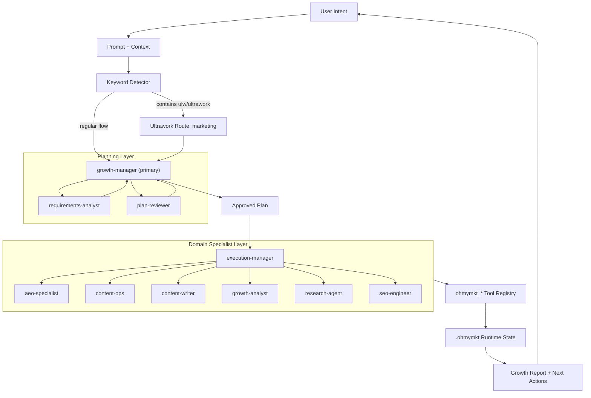
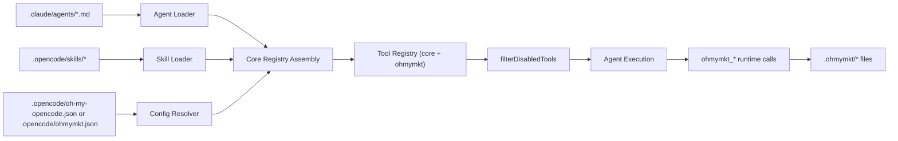
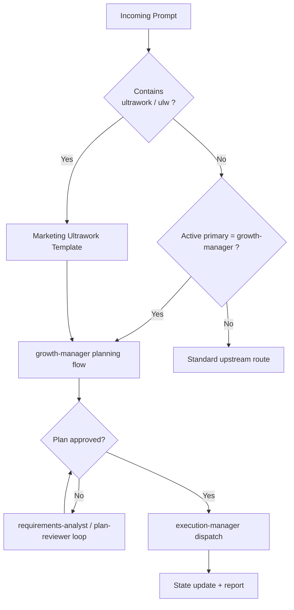
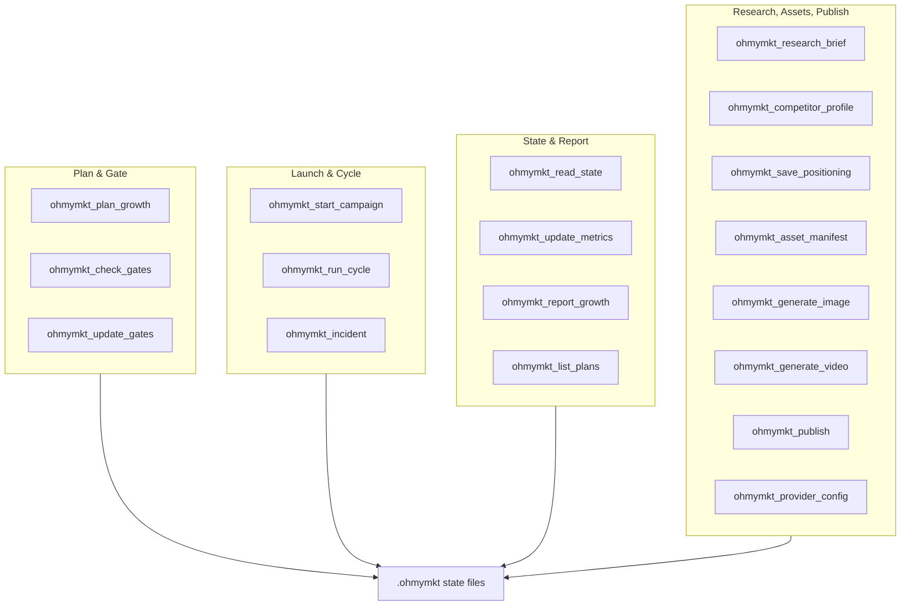
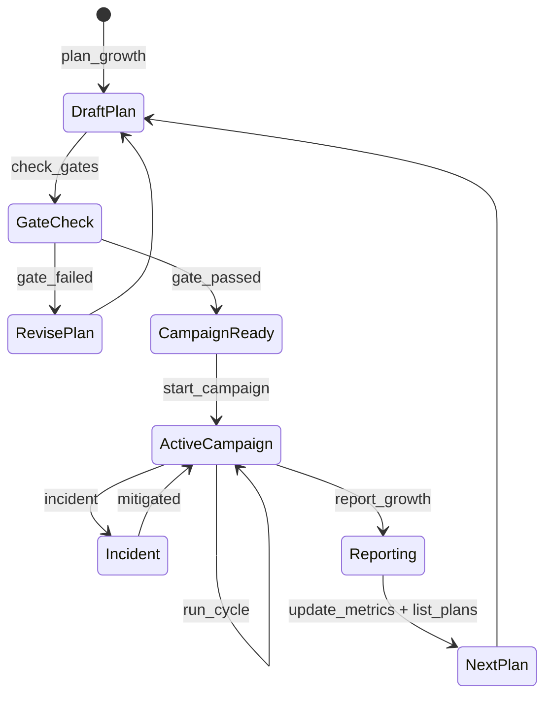

# ohmymkt Overview

`ohmymkt` is a marketing-first OpenCode plugin workspace.
It keeps upstream engine semantics, but swaps in a marketing orchestration topology and runtime.

---

## TL;DR

- Primary orchestrator: `growth-manager`
- Planning gate: `requirements-analyst` + `plan-reviewer`
- Execution hub: `execution-manager`
- Specialist layer: `aeo-specialist`, `content-ops`, `content-writer`, `growth-analyst`, `research-agent`, `seo-engineer`
- Unified runtime tools: 18 `ohmymkt_*` tools
- Runtime persistence root: `.ohmymkt/`
- Fast autonomous trigger: `ultrawork` / `ulw`

---

## Full System Map



---

## Runtime Integration View



Key point: `ohmymkt` extends through native registry points, not side channels.

---

## Mode Routing Matrix



---

## Tool Families and Responsibilities



---

## Runtime State Model



---

## Operational Modes

### Mode A: Ultrawork (fast autonomous)

Prompt example:

```text
ulw launch a 4-week content + SEO growth sprint for our product
```

Behavior:

1. marketing ultrawork template is injected
2. `growth-manager` frames objective/constraints
3. planning gate loop runs
4. `execution-manager` dispatches specialists
5. tools persist state and return measurable report

### Mode B: Planned (high-control)

Use for launch-critical or budget-sensitive work.

1. draft plan via `growth-manager`
2. harden requirements via `requirements-analyst`
3. approve/reject via `plan-reviewer`
4. execute via `execution-manager`

---

## Next Steps

- [Understanding the Orchestration System](./understanding-orchestration-system.md)
- [Orchestration Guide](../orchestration-guide.md)
- [Configurations](../configurations.md)
- [Features](../features.md)
- [Installation](./installation.md)
