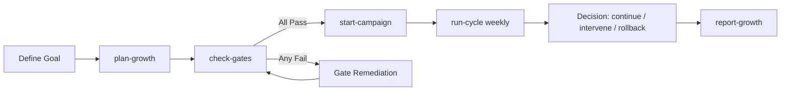

<!--
[INPUT]: Depends on the execution model in docs/seo-aeo-growth-system-2026.md and command interfaces in src/cli.mjs.
[OUTPUT]: Exposes quickstart paths and operating modes for ohmymkt.
[POS]: Entry document of docs/guide, connecting installation, orchestration, and execution.
[PROTOCOL]: Update this header when changed, then check AGENTS.md
-->

# ohmymkt Overview

This guide is the front door for the `ohmymkt` execution system.

If you only read one file before running commands, read this file first.

---

## 1) What ohmymkt Is

`ohmymkt` is a command-driven operating system for SEO + AEO growth.

It enforces three non-negotiable constraints:

1. No scale without passing startup gates.
2. No single-track growth. Visibility and quality must run together.
3. No metric-only updates. Every cycle must end with an explicit decision: `continue`, `intervene`, or `rollback`.

---

## 2) Who This Is For

| Role | Why this guide matters |
|---|---|
| SEO Lead | Owns gate standards and growth priorities |
| Execution Manager | Runs cycle commands and decision loops |
| Technical SEO Engineer | Uses technical foundation module standards |
| Content Ops Manager | Runs dual-track output planning |
| Growth Analyst | Maintains metric integrity and experiment decisions |

---

## 3) Document Map

| Document | Purpose | Read timing |
|---|---|---|
| `docs/guide/overview.md` | Navigation and operating model | First |
| `docs/guide/installation.md` | Environment bootstrap and first-run validation | Before running commands |
| `docs/guide/understanding-orchestration-system.md` | Architecture internals and control loops | After first successful run |
| `docs/seo-aeo-growth-system-2026.md` | Canonical execution handbook and policy | Ongoing reference |

---

## 4) System Lifecycle

Lifecycle states in practice:

1. Planning state: plan exists, campaign not started.
2. Gate remediation state: startup blocked until all gates pass.
3. Active campaign state: dual-track work and periodic cycles running.
4. Incident state: P0/P1/P2 entries affect cycle decisions.
5. Reporting state: weekly/monthly/quarterly plus aggregate summaries.

---

## 5) Core Commands

| Command | Main output | Hard stop conditions |
|---|---|---|
| `plan-growth` | Plan markdown file under `.ohmymkt/plans/` | Empty goal string |
| `check-gates` | Gate report and pass/fail exit code | None |
| `start-campaign` | Boulder state + execution state + sprint board | Any gate fails or no plan exists |
| `run-cycle` | Cycle report + decision + actions | Invalid cadence |
| `incident` | Incident JSON record | Missing severity or summary |
| `report-growth` | Windowed summary report | Invalid window format falls back to default |

---

## 6) Runtime Artifact Map

After first successful startup, `.ohmymkt/` is your source of truth.

| Path | Function |
|---|---|
| `.ohmymkt/plans/*.md` | Approved growth plans |
| `.ohmymkt/state/gates.json` | Startup gate inputs |
| `.ohmymkt/state/metrics.json` | Dual-track trend inputs |
| `.ohmymkt/state/modules.json` | Module grouping by execution tier |
| `.ohmymkt/state/sprint-board.json` | 40-item dispatch board with owner/due/KPI/rollback fields |
| `.ohmymkt/state/execution.json` | Active execution mode and track states |
| `.ohmymkt/state/cycles.json` | Historical cycle decisions |
| `.ohmymkt/boulder.json` | Active plan pointer and execution session metadata |
| `.ohmymkt/incidents/*.json` | P0/P1/P2 incident records |
| `.ohmymkt/reports/**` | Weekly/monthly/quarterly and summary reports |

---

## 7) Gate-First Rule (Critical)

`start-campaign` is intentionally blocked when any startup gate fails.

Minimum pass conditions in current implementation:

- `strategy_gate`: `kpi_tree_bound=true` and `approved=true`
- `compliance_gate`: `documented=true` and `accepted_by_all=true`
- `capacity_gate`: `rolling_weeks_feasible >= 8`
- `data_gate`: `dashboard_stable=true` and `reconcilable=true`
- `ownership_gate`: `priority_query_coverage >= 0.85`

This is not advisory text. It is executable logic in `src/lib/gates.mjs`.

---

## 8) Dual-Track Rule (Critical)

Decision engine behavior in `src/lib/cycle.mjs`:

- If any P0 incident exists in the observation window, decision is `rollback`.
- If visibility trend is up and quality trend is not up, decision is `intervene`.
- If visibility and quality are both up, decision is `continue`.
- Otherwise decision defaults to `intervene`.

Visibility trend keys:

- `visibility_track.non_brand_visibility_trend`
- `visibility_track.query_cluster_coverage_trend`

Quality trend keys:

- `quality_track.high_intent_session_trend`
- `quality_track.conversion_assist_trend`

---

## 9) Typical First Week Runbook

1. Create a plan with `plan-growth`.
2. Populate gate fields in `.ohmymkt/state/gates.json`.
3. Run `check-gates` until all pass.
4. Start campaign with `start-campaign`.
5. Assign owner/due/KPI/rollback values in sprint board.
6. Run first `run-cycle weekly`.
7. Register incidents if needed using `incident`.
8. Generate first aggregate `report-growth --window 7d`.

---

## 10) Anti-Patterns to Avoid

1. Starting campaign before gates pass.
2. Running only visibility track while quality remains flat/down.
3. Logging incidents outside the incident command flow.
4. Treating cycle output as informational instead of decision-binding.
5. Overwriting conflicting metrics without dual-value retention policy.

---

## 11) Success Criteria for Initial Adoption

A healthy first adoption is complete when all conditions are true:

1. At least one plan exists and is referenced by `boulder.json`.
2. All startup gates have passed at least once.
3. One weekly cycle report exists with a clear decision and actions.
4. Sprint board fields (`owner`, `due_date`, `kpi_impact`, `rollback_condition`) are filled for active tasks.
5. One summary report exists and recommendations are actionable.

---

## 12) Next Reading

1. For setup and environment validation: `docs/guide/installation.md`
2. For architecture internals and role choreography: `docs/guide/understanding-orchestration-system.md`
3. For full policy and module SOPs: `docs/seo-aeo-growth-system-2026.md`
