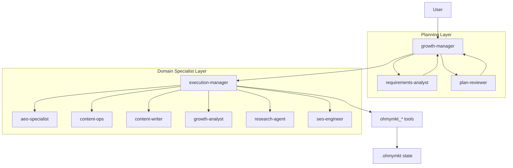

# ohmymkt Overview

ohmymkt is a marketing-first OpenCode plugin workspace.
It keeps the upstream engine, but replaces planning/execution topology with a growth workflow.

---

## TL;DR

- Default primary agent: `growth-manager`
- Planning pair: `requirements-analyst` + `plan-reviewer`
- Execution hub: `execution-manager`
- Domain specialists: `aeo-specialist`, `content-ops`, `content-writer`, `growth-analyst`, `research-agent`, `seo-engineer`
- Marketing runtime tools: 18 tools in `src/tools/ohmymkt/` (`ohmymkt_*`)
- Runtime state folder: `.ohmymkt/`
- Fast lane keyword: `ultrawork` or `ulw`

---

## Architecture Snapshot



---

## Two Working Modes

### 1) Ultrawork Mode (Fast)

Put `ultrawork` or `ulw` in your prompt:

```text
ulw launch a 4-week content + SEO growth plan for our product
```

What happens:

1. The marketing ultrawork route is selected.
2. `growth-manager` frames the objective and constraints.
3. Planning checks run (`requirements-analyst`, `plan-reviewer`).
4. `execution-manager` dispatches domain specialists.
5. `ohmymkt_*` tools persist campaign state, metrics, and outputs.

### 2) Planned Mode (Controlled)

Use this when the task is high-risk (budget, launch date, channel impact).

1. Build/confirm plan with `growth-manager`.
2. Validate assumptions and acceptance criteria via `plan-reviewer`.
3. Approve plan.
4. Run execution through `execution-manager`.

---

## Tooling Model

All project-level marketing agents and skills call the same runtime tool namespace:

- Planning/Gating: `ohmymkt_plan_growth`, `ohmymkt_check_gates`, `ohmymkt_update_gates`
- Execution/Cycle: `ohmymkt_start_campaign`, `ohmymkt_run_cycle`, `ohmymkt_incident`
- Reporting/State: `ohmymkt_report_growth`, `ohmymkt_read_state`, `ohmymkt_update_metrics`
- Research/Content/Publish: `ohmymkt_research_brief`, `ohmymkt_competitor_profile`, `ohmymkt_save_positioning`, `ohmymkt_asset_manifest`, `ohmymkt_generate_image`, `ohmymkt_generate_video`, `ohmymkt_publish`, `ohmymkt_provider_config`

This keeps agent prompts, skills, and runtime behavior aligned.

---

## Runtime State

- Campaign runtime files: `.ohmymkt/`
- Plan artifacts: engine-managed plan/task files (unchanged upstream mechanism)

`ohmymkt` changes topology and capabilities, not the core OpenCode execution skeleton.

---

## Next Steps

- [Understanding the Orchestration System](./understanding-orchestration-system.md)
- [Orchestration Guide](../orchestration-guide.md)
- [Configurations](../configurations.md)
- [Features](../features.md)
- [Installation](./installation.md)
