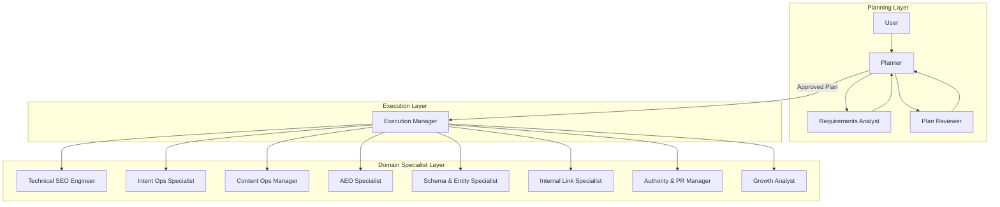
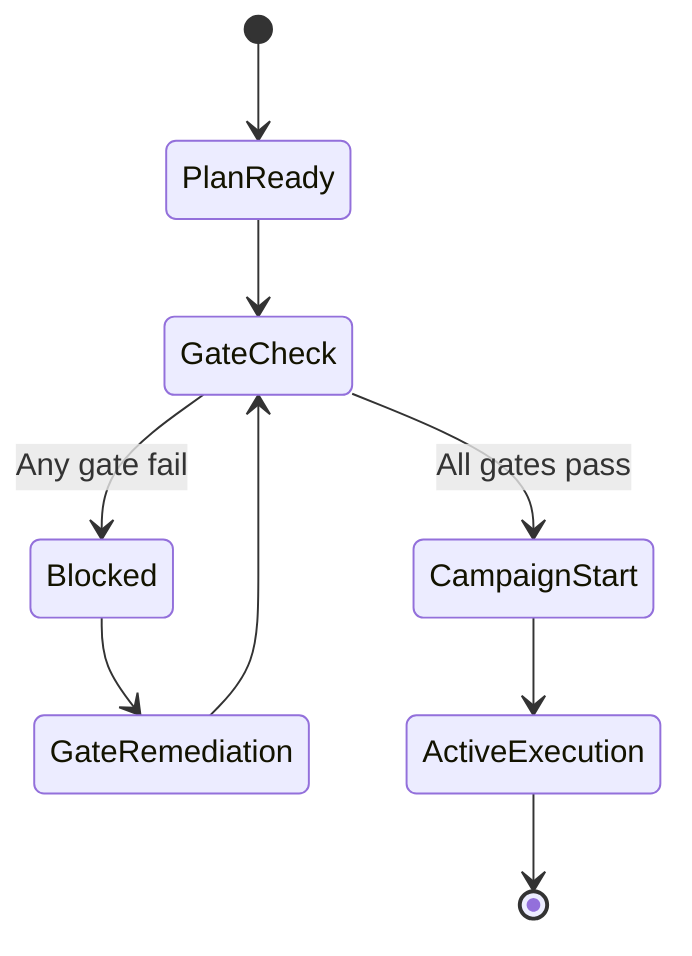
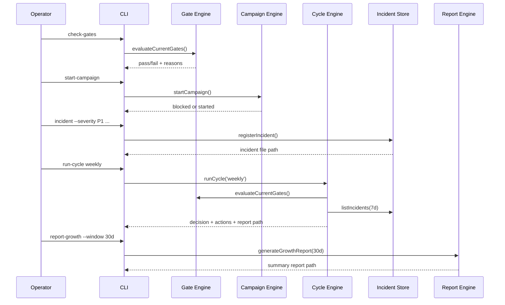

<!--
[INPUT]: Depends on docs/seo-aeo-growth-system-2026.md and gate/cycle/incident protocol implementations in src/lib.
[OUTPUT]: Exposes a deep explanation of the Planner -> Execution Manager orchestration system.
[POS]: Core architecture document in docs/guide, defining why this orchestration works and how to validate it.
[PROTOCOL]: Update this header when changed, then check AGENTS.md
-->

# Understanding the Orchestration System

This document explains the internal orchestration design of `ohmymkt` in implementation-level detail.

It is written to answer three questions:

1. How strategy becomes executable work.
2. How execution remains safe under growth pressure.
3. How decisions stay auditable over time.

---

## 1) Why Orchestration Exists

Most growth programs fail from one of these failure modes:

1. They scale before foundation quality is stable.
2. They optimize visibility while quality and business contribution decay.
3. They publish activity but cannot explain decisions later.

`ohmymkt` solves this with a strict control model:

- **Gate-first control**: no scale without startup readiness.
- **Dual-track balancing**: visibility and quality must progress together.
- **Decision loops**: every cadence yields `continue/intervene/rollback`.
- **Incident protocol**: P0/P1/P2 events are first-class state transitions.

---

## 2) System Goals

The orchestration system is designed to guarantee four properties.

| Property | What it means in practice |
|---|---|
| Safety | High-risk scale actions cannot bypass startup gates |
| Coherence | Track-level and module-level work remain aligned |
| Auditability | Decisions can be reconstructed from runtime artifacts |
| Recoverability | Incident severity directly triggers intervention or rollback paths |

---

## 3) Three-Layer Architecture



Layer responsibilities:

1. **Planning Layer**: defines scope, preconditions, acceptance criteria.
2. **Execution Layer**: applies control logic, cadence, and incident-aware decisions.
3. **Domain Specialist Layer**: executes module-specific tasks under shared rules.

---

## 4) Planning Layer Mechanics

### 4.1 Planner

Planner output must include:

1. Goal statement.
2. Startup gate checklist.
3. Role ownership matrix.
4. Dual-track task baseline.
5. Cadence and incident policy.

Implementation mapping:

- `src/lib/plans.mjs`
- command: `plan-growth`
- artifact: `.ohmymkt/plans/*.md`

### 4.2 Requirements Analyst

Requirements Analyst quality checks:

1. Missing scope boundaries.
2. Ambiguous acceptance criteria.
3. Missing ownership.
4. Hidden gate blockers.
5. Missing rollback conditions.

In this implementation, these checks are codified as process policy and then enforced downstream by gate/cycle constraints.

### 4.3 Plan Reviewer

Plan Reviewer validates:

1. **Executability**: can work be dispatched without assumptions?
2. **Verifiability**: can outcomes be measured from available artifacts?
3. **Recoverability**: does the plan define incident pathways?

No campaign should start if the plan cannot be resolved by `resolvePlan`.

---

## 5) Execution Layer Mechanics

Execution Manager is a control-plane role. It does not invent policy during runtime. It enforces existing policy.

### 5.1 Startup Flow



Implementation mapping:

- `src/lib/gates.mjs`
- `src/lib/campaign.mjs`
- commands: `check-gates`, `start-campaign`

### 5.2 Gate Evaluation Contract

Current gate conditions are deterministic and code-level enforced.

| Gate key | Pass condition |
|---|---|
| `strategy_gate` | `kpi_tree_bound && approved` |
| `compliance_gate` | `documented && accepted_by_all` |
| `capacity_gate` | `rolling_weeks_feasible >= 8` |
| `data_gate` | `dashboard_stable && reconcilable` |
| `ownership_gate` | `priority_query_coverage >= 0.85` |

`start-campaign` blocks when any condition is false.

### 5.3 Campaign Start Side Effects

On successful start:

1. Runtime skeleton directories are created.
2. Template state files are seeded if missing.
3. Notepad folder is created per active plan.
4. Sprint board is generated from 40-task pool.
5. `boulder.json` points to active plan.
6. `execution.json` is set to active dual-track mode.

### 5.4 Cycle Decision Engine

Cycle decisions run by cadence (`weekly`, `monthly`, `quarterly`) in `src/lib/cycle.mjs`.

Decision rules in order:

1. If `P0 > 0` in the observation window -> `rollback`.
2. If visibility trend is up and quality trend is not up -> `intervene`.
3. If both visibility and quality trend are up -> `continue`.
4. Else -> `intervene`.

Trend signals:

- Visibility: `non_brand_visibility_trend`, `query_cluster_coverage_trend`
- Quality: `high_intent_session_trend`, `conversion_assist_trend`

### 5.5 Cadence-Specific Action Augmentation

- Weekly: base action bundle.
- Monthly: base bundle + cluster investment rebalance.
- Quarterly: base bundle + architecture governance review.

---

## 6) Domain Specialist Layer

Each specialist maps to one or more modules from `templates/modules.template.json`.

| Specialist | Primary modules | Core accountability |
|---|---|---|
| Technical SEO Engineer | `technical_foundation` | crawl/index/render/performance reliability |
| Intent Ops Specialist | `intent_operations` | query clustering and URL ownership integrity |
| Content Ops Manager | `content_system` | dual-track content throughput and quality |
| AEO Specialist | `aeo_answer_layer` | extractable answer structure and citation fitness |
| Schema & Entity Specialist | `schema_entity_governance` | schema consistency and entity naming discipline |
| Internal Link Specialist | `internal_link_graph` | navigational depth and bridge continuity |
| Authority & PR Manager | `authority_growth` | relevance-first authority acquisition |
| Growth Analyst | `experiment_engine`, `scale_loop` | controlled experiments and portfolio reallocation |

Dispatch baseline is generated from `templates/task-pool-40.json`.

---

## 7) Runtime State and Artifact Contracts

### 7.1 Directory Layout

```text
.ohmymkt/
  plans/
  notepads/<plan-name>/
  incidents/
  reports/
    weekly/
    monthly/
    quarterly/
    summary/
  state/
    gates.json
    metrics.json
    modules.json
    sprint-board.json
    execution.json
    cycles.json
  boulder.json
```

### 7.2 State Files

| File | Producer | Consumer | Update trigger |
|---|---|---|---|
| `state/gates.json` | `check-gates` seeding or manual update | `check-gates`, `start-campaign`, `run-cycle`, `report-growth` | Gate checks and manual updates |
| `state/metrics.json` | Seed from template then manual/system updates | `run-cycle` decision logic | Before each cycle |
| `state/modules.json` | Seed from template | Operators and tooling | At startup or module governance updates |
| `state/sprint-board.json` | `start-campaign` | Execution workflows | Campaign start and sprint refinement |
| `state/execution.json` | `start-campaign` | `run-cycle` context | Campaign start and mode updates |
| `state/cycles.json` | `run-cycle` | `report-growth` | On each cadence run |
| `boulder.json` | `start-campaign` | Operators and orchestration context | Campaign activation |

### 7.3 Incident Files

Each incident file under `.ohmymkt/incidents/` contains:

- `id`
- `severity`
- `module`
- `summary`
- `created_at`

Allowed severity values are fixed: `P0`, `P1`, `P2`.

---

## 8) Command-to-Orchestration Mapping

| Command | Orchestration responsibility | Primary files touched |
|---|---|---|
| `plan-growth` | Creates actionable planning artifact | `.ohmymkt/plans/*.md` |
| `check-gates` | Evaluates startup readiness | `state/gates.json` |
| `start-campaign` | Moves system from ready to active | `boulder.json`, `state/execution.json`, `state/sprint-board.json` |
| `run-cycle` | Produces cadence decision and action plan | `reports/<cadence>/`, `state/cycles.json` |
| `incident` | Records operational risk events | `incidents/*.json` |
| `report-growth` | Produces management-level summary | `reports/summary/*.md` |

---

## 9) Invariants (Hard Rules)

These rules should never be violated.

1. Scale cannot start if any startup gate fails.
2. A cadence decision must always exist after each cycle run.
3. P0 incidents must produce rollback decisions in the matching observation window.
4. Sprint board items are not considered executable without `owner`, `due_date`, `kpi_impact`, and `rollback_condition`.
5. Data conflicts must preserve both values with provenance and timestamps.

---

## 10) Failure and Recovery Paths

### 10.1 Startup Failure Path

1. `check-gates` returns fail.
2. System remains blocked from campaign start.
3. Gate remediation actions are produced from gate reasons.
4. Re-run `check-gates` after remediation.

### 10.2 Execution Degradation Path

1. `run-cycle` returns `intervene`.
2. Remediation sprint is scheduled on failing modules.
3. Next cycle must validate whether trends recovered.

### 10.3 Critical Incident Path

1. P0 incident recorded.
2. Next cycle returns `rollback` by rule.
3. Scale modules are paused.
4. Postmortem and prevention actions are mandatory.

---

## 11) Validation Checklist for Operators

Use this checklist before claiming orchestration health.

1. All startup gates have reproducible pass evidence.
2. Active plan is set in `boulder.json`.
3. `execution.json` shows both tracks active.
4. Sprint board metadata is complete for active tasks.
5. At least one cycle report exists per required cadence.
6. Incident files exist for all known incidents.
7. Summary report recommendations are acted on or explicitly deferred.

---

## 12) Extension Points

If you extend `ohmymkt`, keep these interfaces stable first.

1. Command contract in `src/cli.mjs`.
2. Gate state schema and pass logic in `src/lib/gates.mjs`.
3. Cycle decision contract in `src/lib/cycle.mjs`.
4. Incident severity protocol in `src/lib/incidents.mjs`.
5. Report aggregation semantics in `src/lib/reports.mjs`.

Recommended extension pattern:

1. Add new module taxonomy in `modules.template.json`.
2. Add dispatchable tasks in `task-pool-40.json` (or versioned successor).
3. Add metric keys only with documented decision impact.
4. Update handbook and guide docs in the same change set.

---

## 13) Sequence Example: Weekly Operations



---

## 14) Practical Interpretation

`ohmymkt` is not a content scheduler and not a dashboard wrapper.

It is a governance engine for growth execution:

1. Plans define intent.
2. Gates enforce readiness.
3. Cycles enforce decision discipline.
4. Incidents enforce safety.
5. Reports enforce accountability.

When those five components are aligned, growth work becomes compounding rather than reactive.
