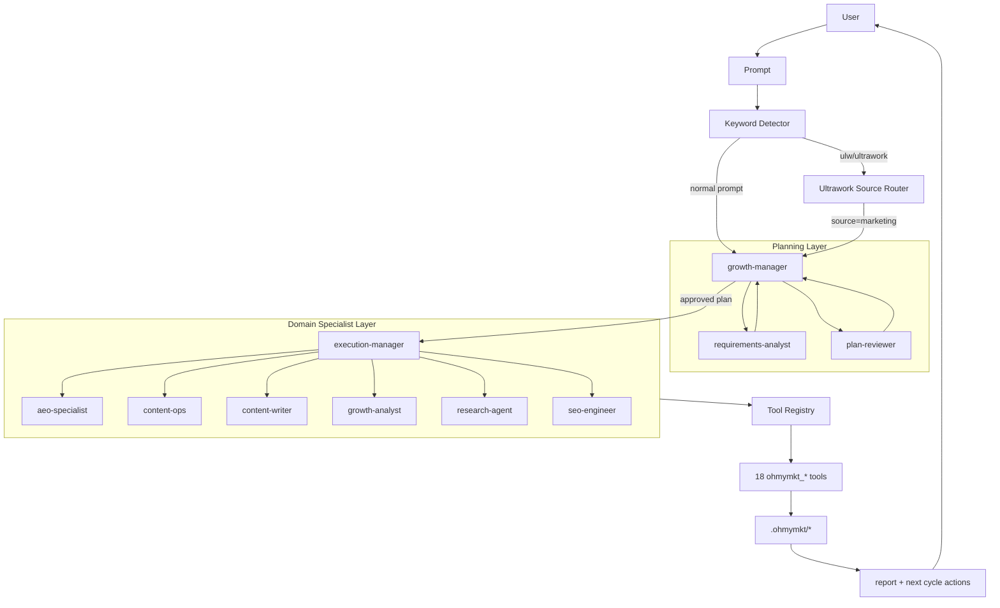
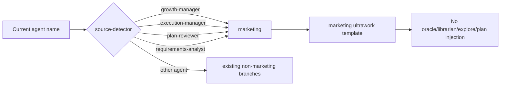
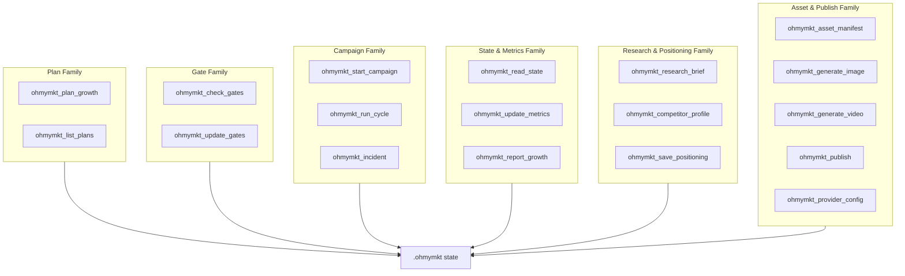
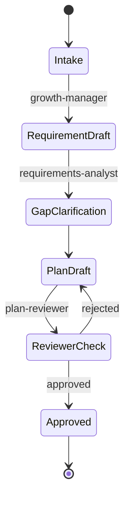
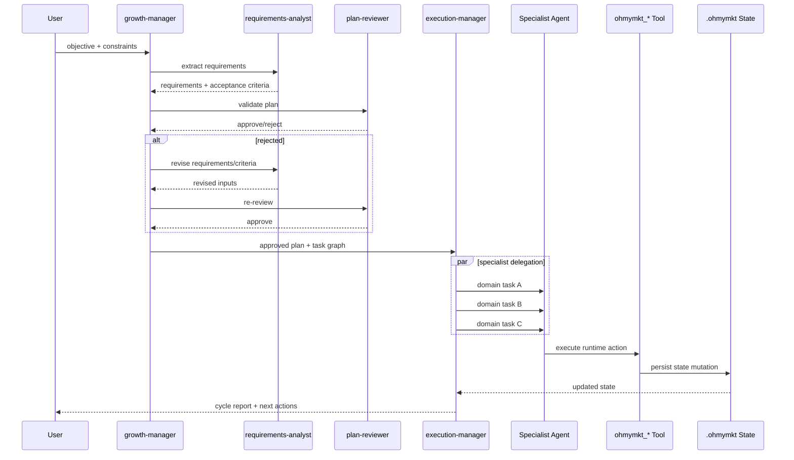
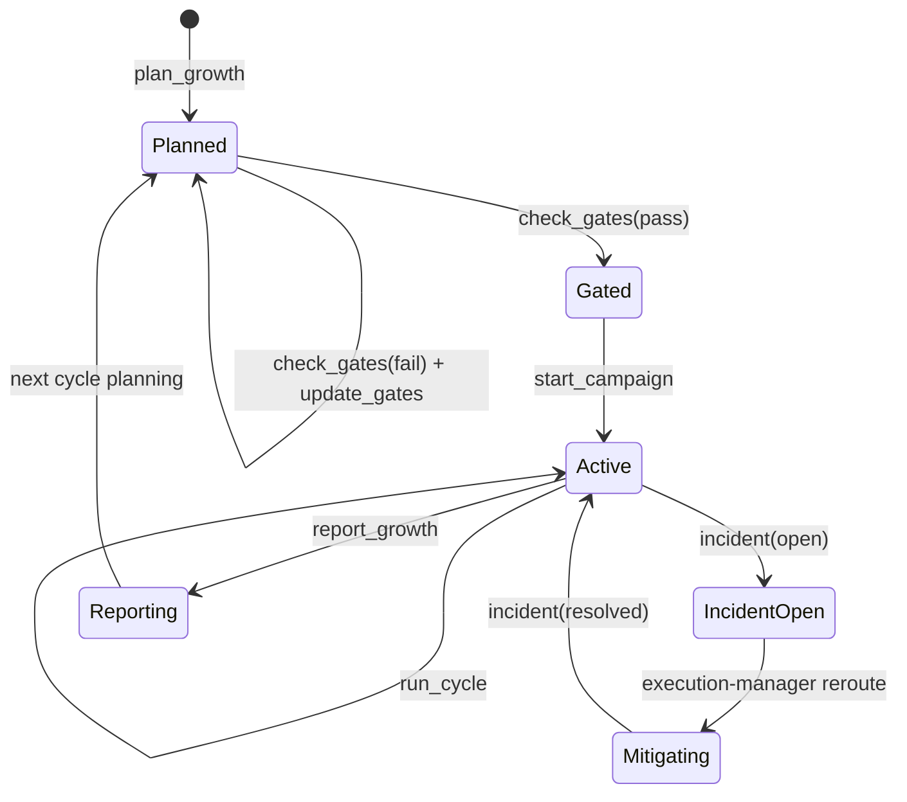
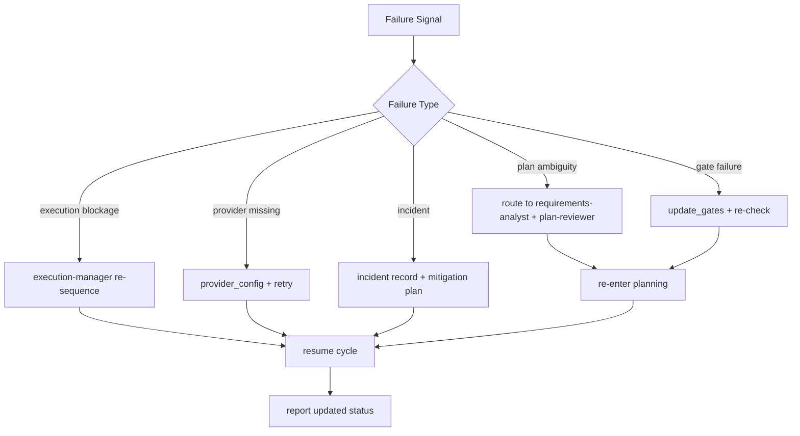

# Understanding the Marketing Orchestration System

This document is the architecture-level contract for `ohmymkt`.
It describes runtime routing, role boundaries, state transitions, and failure handling.

---

## 1. System Purpose

`ohmymkt` converts open-ended user prompts into controlled growth execution by enforcing:

1. planning quality gates
2. execution ownership boundaries
3. stateful runtime persistence
4. measurable reporting loops

---

## 2. End-to-End Topology

---

## 3. Ultrawork Source Routing Contract

Behavioral guarantee:

- marketing sessions only receive marketing hierarchy instructions
- disabled legacy agents are not reintroduced through template text

---

## 4. Layer Responsibilities and Boundaries

## 4.1 Planning Layer

### `growth-manager`

- owns objective framing, priority, and scope boundaries
- chooses whether to iterate planning or proceed to execution
- is final planner authority before execution handoff

### `requirements-analyst`

- converts user intent to explicit requirements
- extracts dependencies, constraints, and unknowns
- writes measurable acceptance criteria

### `plan-reviewer`

- validates completeness and coherence
- rejects plans with ambiguous ownership or unverifiable outcomes
- gates execution entry

Planning invariant:

- no execution dispatch without clear acceptance criteria and ownership mapping

## 4.2 Execution Layer

### `execution-manager`

- turns approved plan into delegated specialist tasks
- sequences tasks by dependency and cadence
- owns runtime tool orchestration (`ohmymkt_*`)
- consolidates output into operator-facing report

Execution invariant:

- stateful actions must go through runtime tools, not free-form text memory

## 4.3 Domain Specialist Layer

- `aeo-specialist`: answer engine discoverability and retrieval-safe formatting
- `content-ops`: editorial workflow, channel scheduling, publishing cadence
- `content-writer`: copy asset creation (text/image/video prompts and drafts)
- `growth-analyst`: metrics diagnosis, hypothesis ranking, iteration decisions
- `research-agent`: market signal collection and competitor intelligence
- `seo-engineer`: technical SEO, structure, schema, indexability

Specialist invariant:

- specialists execute domain tasks; they do not redefine orchestration policy

---

## 5. Tool Contract and Family Graph

Tooling invariant:

- all agent/skill `ohmymkt_*` tokens must resolve to registered tools (contract test enforced)

---

## 6. Runtime State Objects

`ohmymkt` persists under `.ohmymkt/` with template-backed initialization.

Primary object groups:

- plans and active plan references
- gates and gate decision history
- campaign lifecycle status
- metrics snapshots and derived reports
- positioning and asset manifests
- provider configuration pointers

---

## 7. Planning State Machine

Transition rule:

- `PlanDraft -> Approved` only through `ReviewerCheck: approved`

---

## 8. Execution Orchestration Sequence

---

## 9. Campaign Lifecycle State Machine

---

## 10. Failure and Recovery Loop

---

## 11. Non-Negotiable Guardrails

- planning must produce measurable acceptance criteria
- plan approval must precede multi-domain execution
- critical mutations must be written via runtime tools
- marketing ultrawork must not inject disabled legacy agents
- specialist outputs must feed back into shared state before reporting

These constraints keep autonomous behavior deterministic enough for repeated campaign operation.
