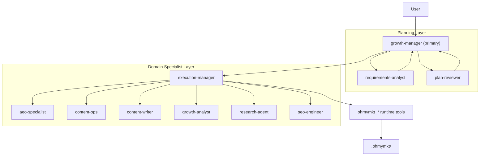
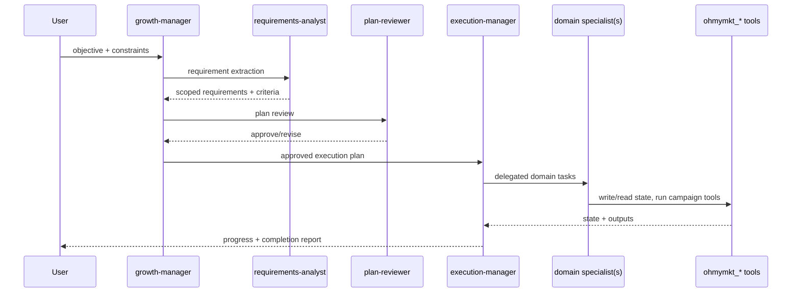

# Understanding the Marketing Orchestration System

This document explains how `ohmymkt` runs a full marketing workflow on top of the upstream OpenCode engine.

The core idea is strict separation:

1. Planning decisions
2. Execution routing
3. Domain production
4. Runtime state + measurement

---

## Why This Design

Single-agent prompting breaks down for growth execution:

- strategy quality drops when execution details flood context
- channel-specific constraints are missed
- progress and metrics are not persisted consistently

`ohmymkt` solves this with layered agents and shared runtime tools.

---

## Layered Topology

---

## Layer Responsibilities

## 1) Planning Layer

### `growth-manager`

- owns objective framing and prioritization
- picks execution path and sequencing
- decides whether to iterate plan or execute now

### `requirements-analyst`

- turns user intent into explicit requirements
- identifies missing inputs, dependencies, and risks
- defines measurable acceptance criteria

### `plan-reviewer`

- stress-tests plan coherence
- blocks weak plans (vague outputs, unowned tasks, missing validation)
- enforces feasibility and verification gates

---

## 2) Execution Layer

### `execution-manager`

- dispatches work to domain specialists
- chooses tool calls (`ohmymkt_*`) for stateful actions
- enforces cadence, dependencies, and completion checks

`execution-manager` is the only layer that should orchestrate multi-specialist execution loops.

---

## 3) Domain Specialist Layer

- `aeo-specialist`: answer-engine optimization and citation-safe structures
- `content-ops`: editorial operations and publishing workflow
- `content-writer`: copy assets (text/image/video briefs)
- `growth-analyst`: measurement, diagnosis, iteration decisions
- `research-agent`: market/competitor signal gathering
- `seo-engineer`: technical SEO, structure, indexability, schema

These specialists are intentionally narrow; orchestration stays above them.

---

## Tool Contract (`ohmymkt_*`)

All marketing flows use the same 18-tool namespace from `src/tools/ohmymkt/`.

Critical paths:

- plan/gate: `ohmymkt_plan_growth`, `ohmymkt_check_gates`, `ohmymkt_update_gates`
- launch/cycle: `ohmymkt_start_campaign`, `ohmymkt_run_cycle`, `ohmymkt_incident`
- reporting/state: `ohmymkt_report_growth`, `ohmymkt_read_state`, `ohmymkt_update_metrics`
- research/content/publish: `ohmymkt_research_brief`, `ohmymkt_competitor_profile`, `ohmymkt_save_positioning`, `ohmymkt_asset_manifest`, `ohmymkt_generate_image`, `ohmymkt_generate_video`, `ohmymkt_publish`, `ohmymkt_provider_config`

This unifies agent prompts, skills, and runtime behavior.

---

## Ultrawork Behavior

`ultrawork` routing now includes a `marketing` source.

When source is marketing (`growth-manager`, `execution-manager`, `plan-reviewer`, `requirements-analyst`):

- injects marketing-specific ultrawork guidance
- references only marketing agents
- avoids disabled legacy agent instructions (`oracle`, `librarian`, `explore`, `plan`)

---

## Runtime State Model

`ohmymkt` runtime files are stored under `.ohmymkt/`.

Typical state artifacts:

- plan snapshots
- gates and check results
- campaign lifecycle state
- metrics and report material
- content asset manifests

State is shared across agent turns through tools, not manual prompt copying.

---

## Execution Loop

---

## Guardrails

- Planning never skips acceptance criteria.
- Execution never bypasses state tools for critical updates.
- Domain agents do not mutate orchestration strategy.
- Ultrawork in marketing sessions never injects disabled legacy agents.

This is the minimum contract to keep output quality stable under autonomous execution.
