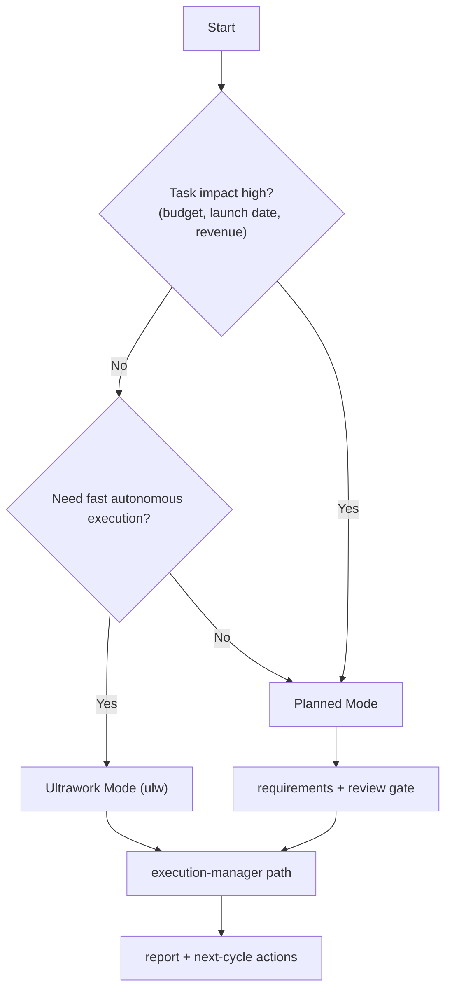
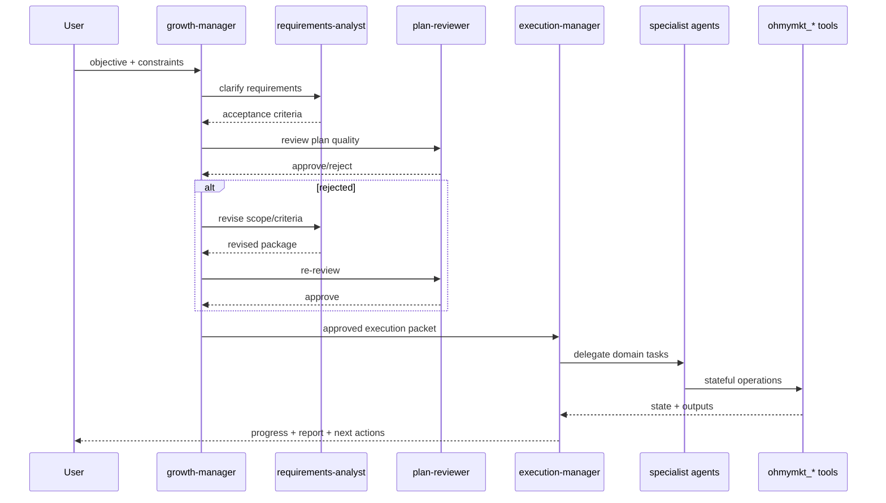
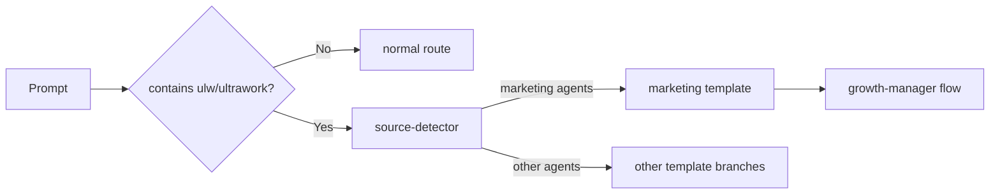
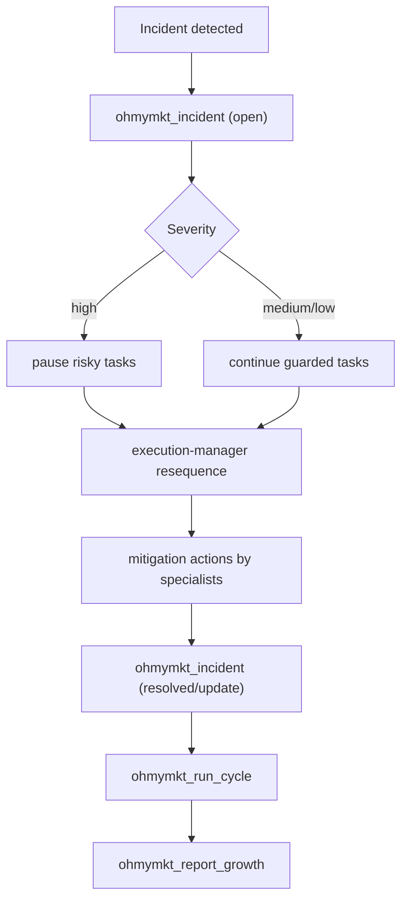
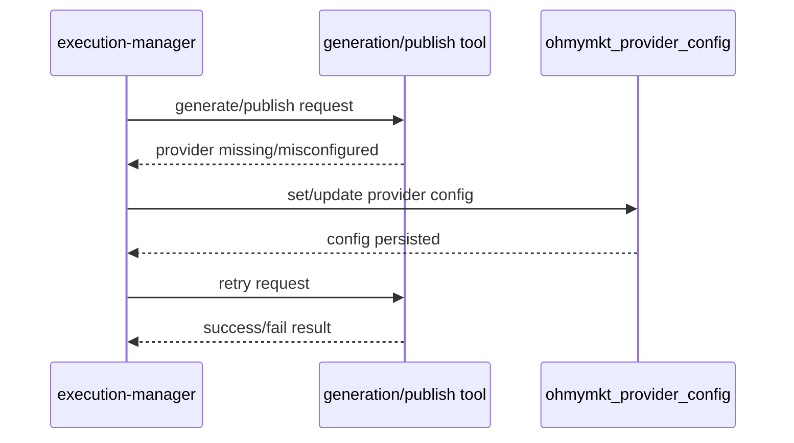
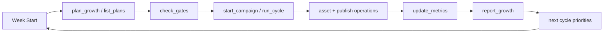

# ohmymkt Orchestration Guide

Operator runbook for marketing execution with the `growth-manager` topology.

---

## 1. Decision Entry



---

## 2. Mode Comparison

| Mode | Trigger | Planning Strictness | Best For | Risk Level |
|---|---|---|---|---|
| Ultrawork | `ultrawork` / `ulw` keyword | medium-to-high (template-driven) | fast iteration, broad discovery | medium |
| Planned | explicit planning/review sequence | highest | launches, paid channels, high-cost execution | low |

---

## 3. Canonical Execution Path



---

## 4. Ultrawork Path Internals

Use prompt:

```text
ulw build a 30-day demand-gen pipeline for our B2B SaaS
```

Router behavior:



Guarantee:

- marketing ultrawork branch does not inject disabled legacy agents

---

## 5. Planned Mode Checklist

Before dispatching execution, confirm all of the following:

1. objective has measurable outcome
2. channels and boundaries are explicit
3. timeline and budget are explicit
4. acceptance criteria are testable
5. rollback/incident route exists
6. owner is assigned per deliverable

If any item fails, send back to `requirements-analyst` and `plan-reviewer`.

---

## 6. Delegation Matrix

| Workstream | Primary Specialist | Supporting Specialist | Typical Tools |
|---|---|---|---|
| Market discovery | `research-agent` | `growth-analyst` | `ohmymkt_research_brief`, `ohmymkt_competitor_profile` |
| Positioning | `content-writer` | `growth-analyst` | `ohmymkt_save_positioning` |
| AEO/SEO implementation | `seo-engineer` | `aeo-specialist` | `ohmymkt_check_gates`, `ohmymkt_update_gates` |
| Campaign operations | `content-ops` | `growth-manager` | `ohmymkt_start_campaign`, `ohmymkt_run_cycle` |
| Performance loop | `growth-analyst` | `execution-manager` | `ohmymkt_update_metrics`, `ohmymkt_report_growth` |
| Asset + distribution | `content-writer` | `content-ops` | `ohmymkt_asset_manifest`, `ohmymkt_generate_image`, `ohmymkt_generate_video`, `ohmymkt_publish` |

---

## 7. Incident Runbook



---

## 8. Provider Failure Runbook



Escalation rule:

- retry once after configuration fix
- if still failing, continue cycle without blocked channel and surface incident

---

## 9. Weekly Cycle Timeline



---

## 10. Anti-Patterns

- bypassing review gates for high-cost launches
- letting specialists self-orchestrate cross-domain sequencing
- keeping campaign truth only in chat text (no runtime state write)
- mixing non-marketing ultrawork templates into marketing sessions

---

## 11. Validation Commands

```bash
# build safety
bun run typecheck
bun run build

# marketing contract checks
bun test src/features/claude-code-agent-loader/loader.test.ts
bun test src/tools/ohmymkt/tools.test.ts
bun test src/tools/ohmymkt/contract.test.ts
bun test src/hooks/keyword-detector/ultrawork/source-detector.test.ts
```

---

## 12. References

- `docs/guide/overview.md`
- `docs/guide/understanding-orchestration-system.md`
- `docs/configurations.md`
- `docs/features.md`
