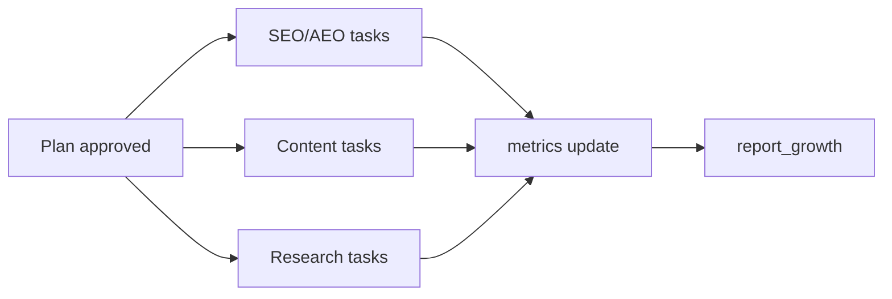
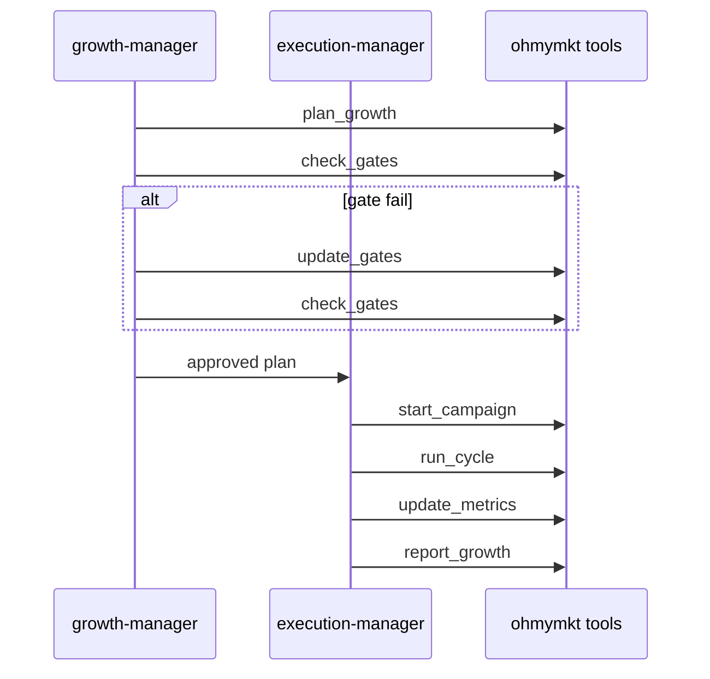

# Task System

`ohmymkt` task flow combines upstream task mechanics with marketing runtime state.

---

## Note on OpenCode/OMO Alignment

The repository keeps upstream task and background mechanisms, while marketing orchestration adds:

- planning gates (`requirements-analyst`, `plan-reviewer`)
- execution ownership (`execution-manager`)
- `.ohmymkt` runtime persistence via `ohmymkt_*` tools

---

## Tools

### Generic Tasking Tools (Upstream)

- `task`
- `background_output`
- `background_cancel`
- todo/task helper hooks and guards

### Marketing Runtime Task Tools

- planning: `ohmymkt_plan_growth`, `ohmymkt_list_plans`
- gate: `ohmymkt_check_gates`, `ohmymkt_update_gates`
- cycle: `ohmymkt_start_campaign`, `ohmymkt_run_cycle`
- incident: `ohmymkt_incident`
- metrics/report: `ohmymkt_update_metrics`, `ohmymkt_report_growth`, `ohmymkt_read_state`

---

## Task Schema (Conceptual)

```json
{
  "id": "task_001",
  "owner": "execution-manager",
  "type": "campaign-cycle",
  "objective": "Increase onboarding activation",
  "acceptance_criteria": [
    "activation rate +5pp",
    "report generated"
  ],
  "dependencies": ["task_000"],
  "status": "in_progress",
  "updated_at": "2026-02-16T00:00:00Z"
}
```

Required fields in practice:

- owner
- measurable acceptance criteria
- explicit dependencies when cross-stream
- state update checkpoints

---

## Dependencies and Parallel Execution



Rules:

- independent specialist tasks can run in parallel
- shared artifacts must define write ownership
- reporting waits for all required dependencies

---

## Example Workflow

1. create plan via `ohmymkt_plan_growth`
2. validate via `ohmymkt_check_gates`
3. if gate fail, patch with `ohmymkt_update_gates`
4. start campaign via `ohmymkt_start_campaign`
5. run execution cycle via `ohmymkt_run_cycle`
6. persist metrics via `ohmymkt_update_metrics`
7. generate report via `ohmymkt_report_growth`



---

## Storage

### Runtime State

- `.ohmymkt/` stores campaign-centric task state and reports

### Engine State

- upstream engine stores session/todo/background-task context separately

---

## Difference from TodoWrite-Only Flow

`TodoWrite` helps per-turn execution tracking.

`ohmymkt` task system additionally provides:

- gate-aware planning
- campaign lifecycle semantics
- persistent cross-turn metrics/report state
- specialist ownership boundaries

---

## When to Use

Use this system when you need:

- campaign-level continuity
- repeatable weekly/monthly cycles
- measurable reporting artifacts
- incident-aware recovery behavior

For one-off ad-hoc small tasks, direct prompting may be sufficient.

---

## Anti-Patterns

- no owner assigned for cross-domain tasks
- no measurable acceptance criteria
- updating campaign truth in chat only (without runtime tool updates)
- skipping gate checks before high-cost execution
