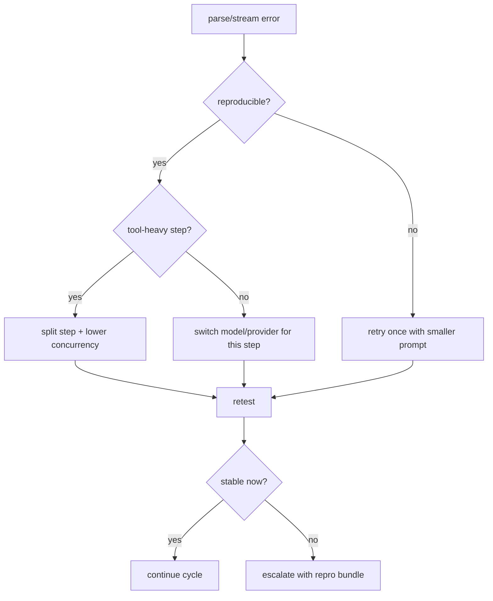

# Ollama Streaming Issue - JSON Parse Error

---

## Problem

When using Ollama-backed models in tool-heavy sessions, you may see errors like:

- JSON parse failures during tool calls
- partial/invalid chunks in streamed responses
- agent stalls after a tool invocation

This can affect planning and execution turns that depend on strict tool-call payloads.

---

## Root Cause

The failure pattern is usually a streaming-format mismatch in the provider/SDK chain during tool-calling responses.

`ohmymkt` itself passes tool payloads through engine interfaces; malformed streaming chunks upstream can still break parser expectations.

### Why This Happens

Common conditions:

1. long multi-tool responses under streaming mode
2. provider wrappers that emit non-conforming incremental JSON
3. high-concurrency workloads with unstable model adapters

---

## Solutions

### Option 1: Disable Streaming (Recommended Immediate Fix)

Use non-streaming behavior for affected provider/model paths where possible.

Why:

- avoids chunk-boundary parse failures
- improves tool-call payload consistency

### Option 2: Reduce Tool-Heavy Pressure Temporarily

If streaming cannot be changed immediately:

- split large prompts into smaller steps
- reduce concurrent delegated tasks
- run gate/planning and execution in separate passes

### Option 3: Move Affected Steps to Stable Provider

For critical cycles, route fragile segments (plan review, tool-heavy reporting) to more stable provider/model combinations.

---

## Workaround Implementation

1. run `doctor` to inspect provider and model health
2. test a minimal tool call
3. run short non-critical prompt with same provider/model
4. if stable, gradually scale task complexity

Suggested sanity prompt:

```text
Read runtime state and summarize one metric delta only.
```

---

## Testing

### Basic Health

```bash
bunx oh-my-opencode doctor --category tools --verbose
```

### Build/Runtime Sanity

```bash
bun run typecheck
bun run build
```

### Marketing Contract Tests

```bash
bun test src/tools/ohmymkt/tools.test.ts
bun test src/tools/ohmymkt/contract.test.ts
```

---

## Related Risk Areas

- high-volume `run_cycle` calls with heavy tool fan-out
- long-form report generation with multiple tool dependencies
- mixed provider fallback chains during partial failures

---

## Escalation Checklist

Before escalating, capture:

1. exact prompt
2. provider/model pair
3. whether streaming was enabled
4. minimal reproducible tool sequence
5. relevant logs/error snippets

This reduces triage time significantly.

---

## Decision Flow


