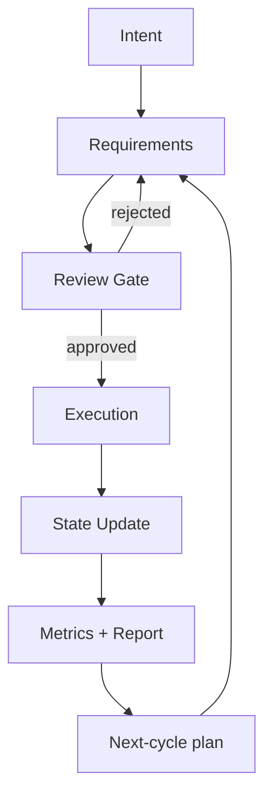
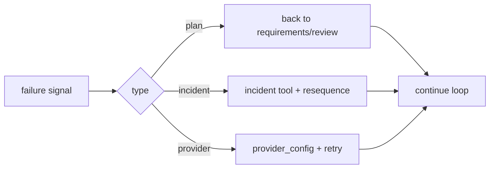

# Manifesto

The principles behind `ohmymkt` ultrawork.

---

## Human Intervention Is a Failure Signal

In campaign operations, constant operator interruption is usually a systems design problem, not a talent problem.

If an autonomous system keeps asking basic questions mid-flight, one of these failed:

1. requirement extraction
2. planning gate quality
3. execution ownership
4. runtime state persistence

`ohmymkt` ultrawork is designed to reduce interruptions by improving those four layers.

---

## Indistinguishable Operational Output

The target is not "AI-looking output." The target is output that survives review by experienced marketers and operators:

- clear ownership
- measurable acceptance criteria
- auditable state transitions
- concrete next actions

---

## Token Cost vs Productivity

Ultra-autonomous workflows can look expensive per session but often reduce total organizational cost by:

- eliminating repetitive clarification loops
- reducing rework from ambiguous plans
- preserving state for iterative cycles

Cost control should happen through model/category tuning and concurrency policy, not by deleting orchestration rigor.

---

## Minimize Human Cognitive Load

The system should take over the burdens humans are bad at sustaining under pressure:

- dependency bookkeeping
- multi-stream coordination
- continuous metric-state reconciliation

Humans should own intent, constraints, and final decision authority.

---

## Two Approaches

### Approach 1: Planned Mode (Interview + Review Gate)

Best for high-stakes tasks:

- budget-heavy channel launches
- pricing and positioning shifts
- irreversible publication windows

Flow:

1. `growth-manager` frames objective
2. `requirements-analyst` resolves ambiguity
3. `plan-reviewer` approves/rejects
4. `execution-manager` runs approved plan

### Approach 2: Ultrawork Mode (Just Do It)

Use keyword `ultrawork` / `ulw` for rapid autonomous execution.

`ohmymkt` keeps this mode structured by enforcing marketing source routing and runtime state updates.

---

## Predictable, Continuous, Delegatable

### Predictable

No hidden ownership. Every critical action has an owner and criterion.

### Continuous

State persists under `.ohmymkt/` so cycle N+1 does not restart from zero knowledge.

### Delegatable

Work splits by domain specialists while execution policy remains centralized in `execution-manager`.

---

## The Core Loop

---

## What This Means in Practice

1. If acceptance criteria are unclear, execution should block.
2. If state is not persisted, completion claims are weak.
3. If specialists self-orchestrate policy, quality drifts.
4. If incidents are unmanaged, cycles become noisy and unreliable.

---

## Failure Handling as First-Class Behavior

Autonomy is only real if failure recovery is designed upfront.

---

## The Future We're Building

A marketing execution system where:

- operators define direction, not every micro-step
- plans are reviewable and testable
- cycles produce consistent artifacts, not ad-hoc chat fragments
- learning compounds because state is durable

---

## Further Reading

- `docs/guide/overview.md`
- `docs/guide/understanding-orchestration-system.md`
- `docs/orchestration-guide.md`
- `docs/task-system.md`
